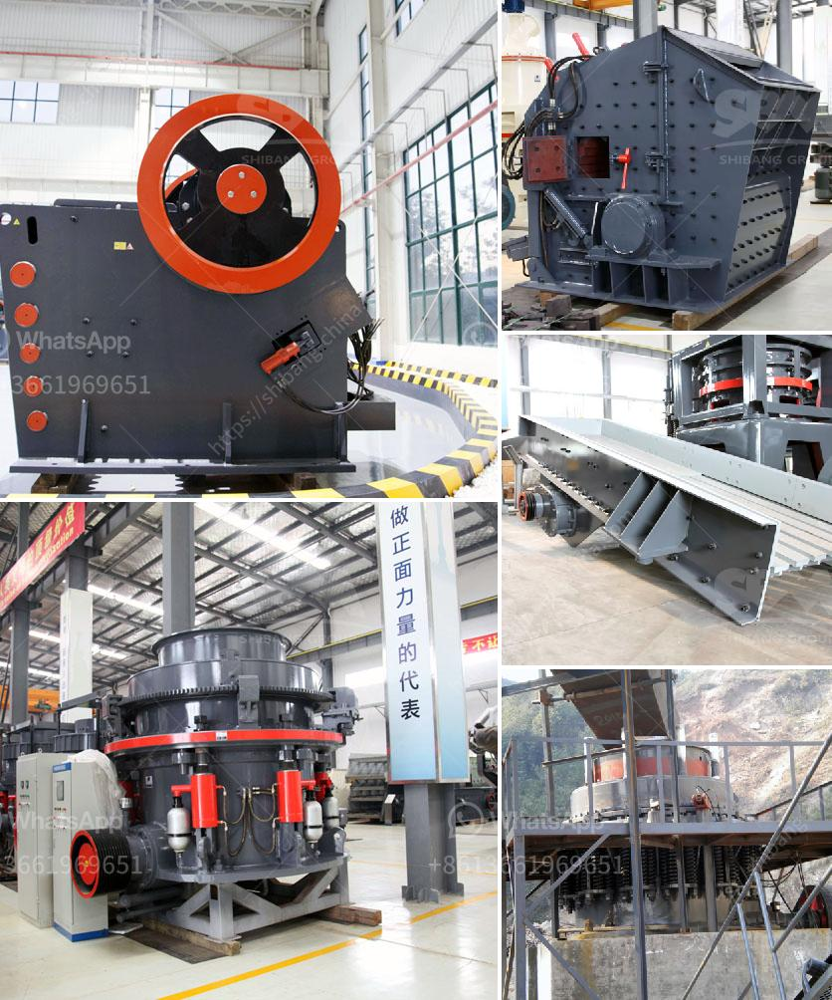

<h3>processing of limestone and crushing</h3>
Limestone is a sedimentary rock composed mainly of calcium carbonate (CaCO3). It is one of the most common rocks in the world and is primarily used for construction purposes. Limestone is readily available and relatively easy to cut into blocks or more elaborate carving. It is also long-lasting and stands up well to exposure. However, it does require regular maintenance, as it can be susceptible to erosion over time.

The first step in the limestone processing is to crush the limestone into smaller particles. This is accomplished by a variety of methods, including jaw crusher, impact crusher, cone crusher, and so on. Every method has its own specific design and performance advantages, thus ensuring the crushing process can be completed smoothly.

In the limestone production line, the first step is to crush the limestone. Limestone crusher machine include Jaw crusher, Impact Crusher, Cone Crusher and Mobile Crusher. Crush the limestone is very necessary in limestone processing plant, meanwhile limestone crushing machine is the key products of limestone production line. So the quality of limestone crusher machine is quite important.

In addition, PEW jaw crusher, which is a new generation crushing machine, using the most advanced European technology with a reliable performance. It is the ideal for being used as primary crusher in the limestone production line. After crushing, if we need more fine products, we need to grind limestone.

Limestone grinding machine include Raymond Mill, MTM Medium Speed Trapezium Mill, MTW Trapezium Mill, XZM Ultrafine Mill. They are all the most popular high efficient grinding machine in the market. They have many different models, with different output sizes, so choose the right limestone crusher and limestone grinding mill is important.

The limestone crushing process takes place in a closed circuit, where an impact crusher (or hammer crusher) is fitted as the secondary crusher. The crushed limestone materials will then be transferred to vibrating screen for separation. After separation, products in required size will be retained as final products, while the rest will be returned to the previous impact crusher for another crushing until they reach the desired size.

The process of limestone crushing is quite simple. First, the limestone rock is mined from the quarry. The mining process usually consists of drilling and blasting followed by crushing, screening, and transportation. Once the limestone is obtained, it needs to be crushed by a crusher to a suitable size.

Limestone crushers are used in a variety of applications, including mining, smelting, building materials, highways, railways, water conservancy, and chemical industries, as well as other sectors. Limestone crushing process has been simplified to save the investment and operation costs, while the recovery rate is improved. 

In conclusion, limestone crushing process requires limestone crusher machines, feeding materials into limestone crusher, and sieving out required sizes. Next, these crushed limestone materials will be transported to the vibrating screen, and separated to different sizes for further processing. The whole process of limestone crushing involves heavy duty crushing machinery that can efficiently handle limestone and minimize the deleterious impact on the environment and energy consumption.
<h3>Contact us</h3><ul><li><strong>Whatsapp:&nbsp;<a href="https://wa.me/8613661969651">+8613661969651</a></strong></li><li><a href="https://swt.shibang-china.com/?git&amp;zhl&amp;processing of limestone and crushing"><strong>Online Service(chat now)</strong></a></li></ul><h3>Related</h3><ul><li><a href='manufacturers of 3 tph vertical roller mill in china.md'>manufacturers of 3 tph vertical roller mill in china</a></li><li><a href='rotary dryer machine photo.md'>rotary dryer machine photo</a></li><li><a href='coal mill outlet temperature.md'>coal mill outlet temperature</a></li><li><a href='prices stone crusher machine.md'>prices stone crusher machine</a></li><li><a href='calcium carbonate crushing machine.md'>calcium carbonate crushing machine</a></li></ul>