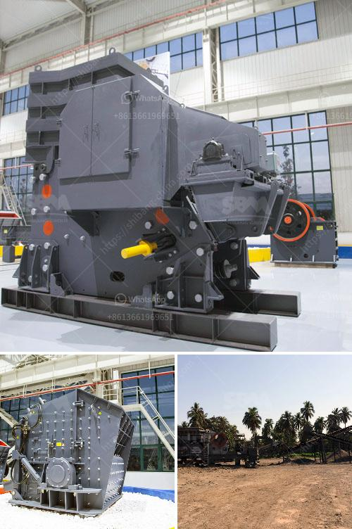

<h3>processing plant for chrome for sale</h3>
Chrome, a versatile and durable metal, is widely used in various industries such as aerospace, automotive, and construction. Its unique properties, including high resistance to corrosion and excellent heat resistance, make it a sought-after material in the manufacturing world. As the demand for chrome continues to rise, it becomes essential to invest in efficient processing plants that can meet the industry's requirements. This article delves into the significance of a chrome processing plant for sale and highlights its potential benefits.

A chrome processing plant plays a pivotal role in transforming raw chrome ore into a usable product. It involves several stages, including crushing, grinding, gravity separation, and flotation, to derive a concentrate with the desired grade and quality. The process ensures the removal of impurities and maximizes the recovery of chrome, thereby enhancing the economic value of the final product.

One of the primary advantages of investing in a processing plant for chrome is the ability to control the entire production process. Having a customized plant tailored to specific requirements allows manufacturers to adapt to changing market demands and optimize their operations. The integration of advanced technologies and automated systems in the plant further streamlines the production process, minimizing human error and increasing overall efficiency.

Efficiency is not the only benefit a chrome processing plant offers; it also enhances productivity. By owning a dedicated processing plant, manufacturers can eliminate dependence on external suppliers and maintain a steady supply chain, reducing delays and uncertainties. The plant's continuous operations ensure a steady production rate and consistent product quality, meeting customer expectations and resulting in higher customer satisfaction.

Moreover, a processing plant enables manufacturers to have better control over the quality of the final product. By monitoring and optimizing each stage of the process, they can ensure that the chrome concentrate meets the required specifications, such as grade, chemical composition, and particle size distribution. This quality control instills confidence in customers, establishing a reputation for reliability and excellence.

Investing in a chrome processing plant for sale also carries significant economic advantages. With the ability to refine raw chrome ore into a valuable concentrate, manufacturers can generate substantial profits. The extracted chrome concentrate can be sold to various industries, creating additional revenue streams. Furthermore, having a processing plant allows manufacturers to explore new market opportunities and expand their customer base, resulting in long-term financial growth.

Lastly, from an environmental perspective, a well-designed processing plant contributes to sustainable business practices. By implementing efficient processes and adopting eco-friendly technologies, such as water recycling and waste reduction programs, manufacturers can minimize their carbon footprint and support a greener future.

In conclusion, a chrome processing plant for sale plays a pivotal role in meeting the growing demand for chrome while maximizing efficiency, productivity, and profitability. Investing in a customized plant allows manufacturers to have control over the entire production process, ensuring consistent quality and meeting customer expectations. Additionally, it enables businesses to explore diverse market opportunities and contribute to sustainable practices. As the chrome industry thrives, having a reliable processing plant becomes a significant asset for manufacturers seeking to stay competitive and meet the evolving needs of the market.
<h3>Contact us</h3><ul><li><strong>Whatsapp:&nbsp;<a href="https://wa.me/8613661969651">+8613661969651</a></strong></li><li><a href="https://swt.shibang-china.com/?git&amp;zhl&amp;processing plant for chrome for sale"><strong>Online Service(chat now)</strong></a></li></ul><h3>Related</h3><ul><li><a href='white stone crusher plant in rajasthan.md'>white stone crusher plant in rajasthan</a></li><li><a href='primary crusher ball milling pengertian.md'>primary crusher ball milling pengertian</a></li><li><a href='cost of setting up a kaolin production plant.md'>cost of setting up a kaolin production plant</a></li><li><a href='stone crusher in cebu.md'>stone crusher in cebu</a></li><li><a href='pharma grade kaolin process.md'>pharma grade kaolin process</a></li></ul>