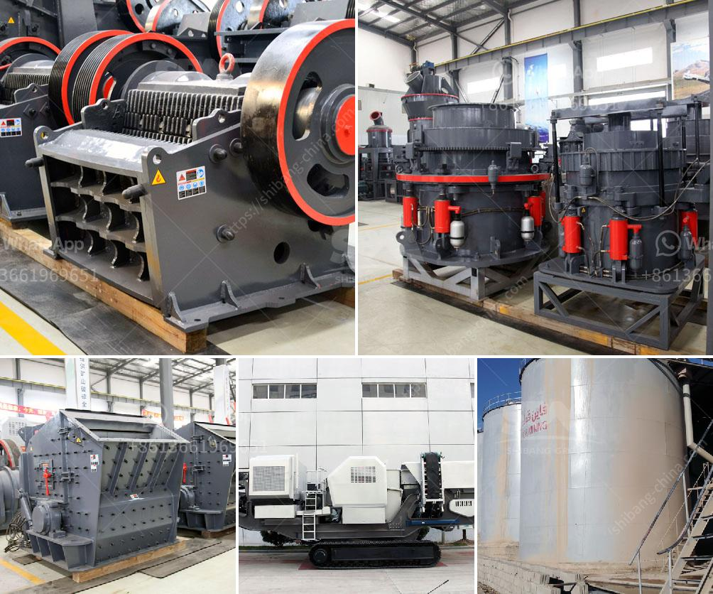

<h3>production process of limestone</h3>
The production process of limestone involves several stages and a variety of machines. The first stage in the production process is the extraction of limestone from the quarry. This involves separating the rock from the rest of the ground using heavy machinery such as excavators and front-end loaders.

The extracted limestone is then transported to a processing plant where it undergoes several crushing and screening stages until it reaches the desired size. Based on the required size of the limestone, it can be further crushed using various crushing machines such as jaw crushers and impact crushers.

After the crushing stage, the limestone is classified into different grades depending on its size. This is done using vibrating screens that separate the limestone into different size fractions. These fractions are used in various industries such as construction, agriculture, and manufacturing.

Once the limestone is classified into different sizes, it is then transported to the grinding mill for further processing. In the grinding mill, the limestone is ground into a fine powder. This powder is used in various ways, such as in the production of cement, paper, and paints.

The grinding process is done using a variety of grinding machines, such as ball mills, roller mills, and hammer mills. These machines grind the limestone to a fine powder, which is then mixed with other materials to create the final product.

After the limestone is ground and mixed with other materials, it undergoes several other processes depending on the end product desired. For example, if the limestone is being used in the production of cement, it is mixed with other materials such as gypsum and clay and heated in a kiln to create clinker. The clinker is then ground with other additives to produce cement.

In addition to its use in cement production, limestone is also used in the manufacturing of glass, steel, and water treatment chemicals. Each industry may have its own specific process for the use of limestone, but the basic production process remains the same.

Overall, the production process of limestone involves extraction, crushing, grinding, classification, and further processing. Each stage requires specific machinery and careful attention to detail to ensure the quality of the final product. Limestone is a versatile material that plays a crucial role in various industries, and its production process is integral to meeting the demands of these industries.
<h3>Contact us</h3><ul><li><strong>Whatsapp:&nbsp;<a href="https://wa.me/8613661969651">+8613661969651</a></strong></li><li><a href="https://swt.shibang-china.com/?git&amp;zhl&amp;production process of limestone"><strong>Online Service(chat now)</strong></a></li></ul><h3>Related</h3><ul><li><a href='roller mill for powders.md'>roller mill for powders</a></li><li><a href='stone crushing machine suppliers.md'>stone +crushing +machine +suppliers</a></li><li><a href='coal washing machines.md'>coal washing machines</a></li><li><a href='second hand jaw crusher philippines.md'>second hand jaw crusher philippines</a></li><li><a href='tons per hour cement grinding plant.md'>tons per hour cement grinding plant</a></li></ul>