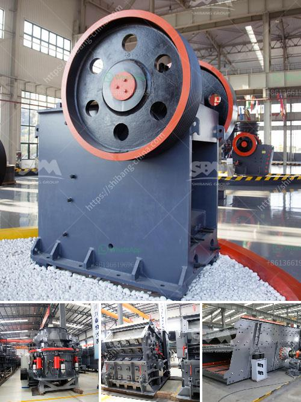

<h3>project report clinker grinding</h3>
Clinker grinding is an important process in cement production. In the cement manufacturing process, the clinker is produced from the raw materials such as limestone, clay, and iron ore in a rotary kiln at high temperatures. The clinker is then finely ground to create cement.

A project report on clinker grinding is an essential document for anyone involved in the cement industry. This report provides detailed information on the process, machinery used, current market trends, and financial analysis of the clinker grinding plant.

The clinker grinding plant includes a feed hopper, pre-crusher, weigh feeder, clinker hopper, ball mill, rotary kiln, cement mill, and packing plant. The process is designed to be efficient and cost-effective by optimizing the energy consumption and reducing waste.

The clinker grinding plant requires the use of advanced technology and equipment, such as vertical roller mills, roller presses, and tube mills. These mills are energy-efficient and designed to produce a uniform particle size distribution, resulting in high-quality cement.

The project report includes a detailed analysis of the market demand for cement, both domestically and internationally. It examines the growth potential, opportunities, and challenges in the cement industry. The report also provides insights into the competitive landscape and strategies adopted by key players in the market.

Financial analysis is an integral part of the project report, providing information on the investment required, project cost, revenue projections, and profitability analysis. This helps stakeholders assess the feasibility and viability of the clinker grinding project.

In conclusion, a project report on clinker grinding provides valuable information for investors, industry professionals, and stakeholders in the cement industry. It outlines the process, machinery, market trends, and financial analysis of the clinker grinding plant. This report acts as a guide for decision-making, enabling stakeholders to make informed choices and maximize returns on investment in the cement industry.
<h3>Contact us</h3><ul><li><strong>Whatsapp:&nbsp;<a href="https://wa.me/8613661969651">+8613661969651</a></strong></li><li><a href="https://swt.shibang-china.com/?git&amp;zhl&amp;project report clinker grinding"><strong>Online Service(chat now)</strong></a></li></ul><h3>Related</h3><ul><li><a href='sell jaw crusher jaw pe 250x400 tph.md'>sell jaw crusher jaw pe 250x400 tph</a></li><li><a href='lime stone pulverizer machine manufacturers.md'>lime stone pulverizer machine manufacturers</a></li><li><a href='copper making process.md'>copper making process</a></li><li><a href='used sand dryer for sale australia.md'>used sand dryer for sale australia</a></li><li><a href='iron ore grinding ball mill details.md'>iron ore grinding ball mill details</a></li></ul>