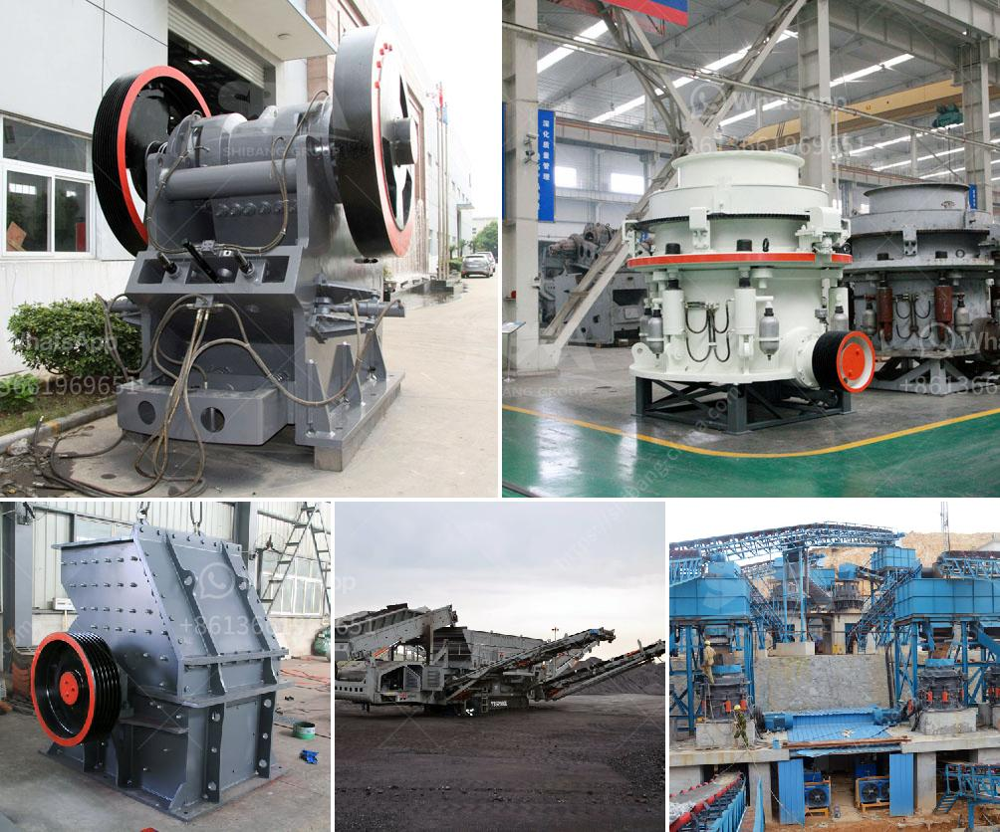

<h3>project report for quartz stone plant and quarry</h3>
Quartz, a mineral composed of silicon and oxygen atoms, is one of the most abundant minerals found on Earth. It has various industrial uses, including in the production of glass, ceramics, and electronic devices. With the increasing demand for quartz products, establishing a quartz stone plant and quarry can be a lucrative business venture.

A project report for a quartz stone plant and quarry outlines the key aspects of the establishment, including the target market, production capacity, legal and environmental considerations, and financial projections. Such a report is essential for obtaining funding and ensuring the smooth execution of the project.

Firstly, the report will identify the target market for the quartz stone products. This involves conducting market research to determine the demand and potential customers in the area. It will also analyze the competition and identify unique selling points or advantages that the project can offer.

Secondly, the report will discuss the production capacity of the plant and quarry. This includes determining the amount of quartz stone that can be extracted from the quarry and processed in the plant. It will also outline the equipment and machinery required for the operations, as well as the estimated operational costs.

Next, the report will address the legal and environmental considerations associated with the project. This involves obtaining the necessary permits and licenses to operate the quarry and plant. It will also discuss measures to ensure sustainable and responsible mining practices to minimize the environmental impact.

Lastly, the report will provide financial projections for the project. This includes estimating the initial investment required, as well as the expected revenue and profit margins. It will also analyze the risk factors and provide mitigation strategies.

In conclusion, a project report for a quartz stone plant and quarry is a comprehensive document that outlines the key aspects of establishing such a venture. It provides crucial information for securing funding and ensuring the successful implementation of the project. With thorough planning and execution, a quartz stone plant and quarry can be a profitable business opportunity in the growing quartz industry.
<h3>Contact us</h3><ul><li><strong>Whatsapp:&nbsp;<a href="https://wa.me/8613661969651">+8613661969651</a></strong></li><li><a href="https://swt.shibang-china.com/?git&amp;zhl&amp;project report for quartz stone plant and quarry"><strong>Online Service(chat now)</strong></a></li></ul><h3>Related</h3><ul><li><a href='trapizium mill for purvelising.md'>trapizium mill for purvelising</a></li><li><a href='quarry crusher zimbabwe.md'>quarry crusher zimbabwe</a></li><li><a href='small ball mill prices in kenya.md'>small ball mill prices in kenya</a></li><li><a href='crushed stone suppliers manufacture india.md'>crushed stone suppliers manufacture india</a></li><li><a href='cement plant for sale south africa.md'>cement plant for sale south africa</a></li></ul>