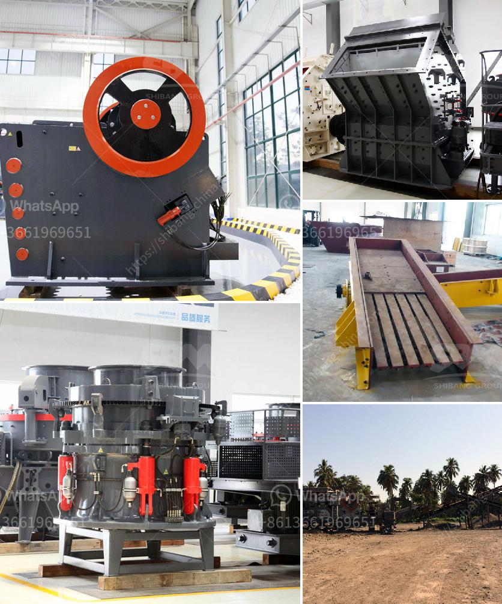

<h3>project report of a tph stone crusher</h3>
Stone crusher is essential equipment in mining machinery, and is widely used in the mining industry. The stone crusher has a variety of types, such as jaw crusher, cone crusher, impact crusher, hammer crusher and mobile crusher. And so on, covering all aspects of coarse crushing and fine crushing. According to the different needs of customers, the stone crusher can be divided into different models.

The TPH stone crusher is one of the popular stone crushers, which is widely used in various industries. As the leading stone crusher manufacturer and exporter in China, we will provide maximum preferential factory price and discount for you. Our stone crusher has been exported to South Africa, Kenya, Nigeria, Ethiopia, Zambia, Namibia, Somalia, Nepal, Pakistan, Bangladesh, Philippines, Malaysia, Saudi Arabia, Sudan, Tanzania, Zambia, Zimbabwe, Uganda, United Arab Emirates, Ghana, Sierra Leone, India, Indonesia, Singapore, Australia, Sri Lanka, Vietnam, Bangladesh, etc.

In order to successfully set up a TPH stone crushing plant, we need to understand the project requirements, choose suitable crusher equipment, and coordinate with other equipment suppliers. As a professional stone crusher manufacturer, we have rich experience in designing and producing various types of stone crushers. In addition, we have established a strict quality management system to ensure the quality of the products.

The project report of a TPH stone crusher is a crucial document for investors and lenders as it contains information regarding the profitability, sustainability, payback period, and break-even analysis of the project. To prepare a detailed project report, you need to conduct a feasibility study, provide detailed information about the stone crusher, financial aspects, and overall project cost estimation.

In conclusion, the project report of a TPH stone crusher is a valuable document that helps stakeholders evaluate the viability of the project, plan for its implementation, and monitor the progress. With thorough research and careful analysis, you can ensure the success of your stone crushing project.
<h3>Contact us</h3><ul><li><strong>Whatsapp:&nbsp;<a href="https://wa.me/8613661969651">+8613661969651</a></strong></li><li><a href="https://swt.shibang-china.com/?git&amp;zhl&amp;project report of a tph stone crusher"><strong>Online Service(chat now)</strong></a></li></ul><h3>Related</h3><ul><li><a href='conveyor belt system manufacturers in turkey.md'>conveyor belt system manufacturers in turkey</a></li><li><a href='overhaul jaw crusher.md'>overhaul jaw crusher</a></li><li><a href='conveyor belts for buckets.md'>conveyor belts for buckets</a></li><li><a href='barite rock mill.md'>barite rock mill</a></li><li><a href='coal crusher design.md'>coal crusher design</a></li></ul>