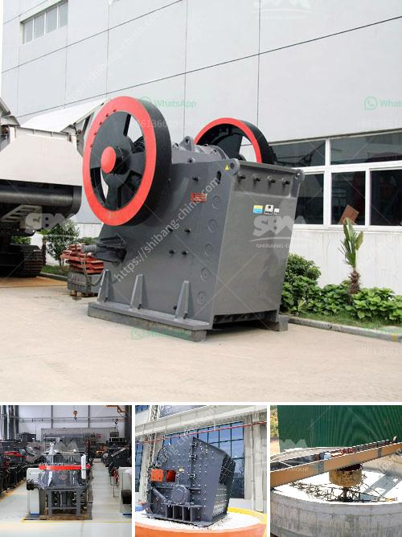

<h3>project report on concrete crusher pdf</h3>
The increasing demand for sustainable and efficient construction practices has led to the innovation of various technologies and equipment. One such example is the concrete crusher, designed to break down concrete into smaller, manageable pieces. This project report aims to explore the potential benefits and limitations of using a concrete crusher in construction projects.

A concrete crusher is a machine designed to reduce large chunks of concrete into smaller pieces suitable for further processing or recycling. It provides a cost-effective and eco-friendly method for demolishing concrete structures, thus reducing construction waste and minimizing environmental impact. Additionally, using recycled concrete reduces the need for new aggregates, conserves natural resources, and lowers carbon emissions associated with concrete manufacturing.

Concrete crushers come in various designs, but most incorporate a rotating drum with hardened steel bars or hammers that crush the concrete against a sturdy plate. The size and shape of the final crushed material can be adjusted by using different screens or adjusting the gap between the bars or hammers. Some advanced models also feature hydraulic mechanisms for increased efficiency and ease of use.

Concrete crushers are primarily used in the construction industry for demolishing concrete structures, such as buildings, pavements, bridges, and retaining walls. They can also be employed for breaking down concrete slabs or chunks into smaller sizes to be recycled or used as backfill material. However, it is important to consider the limitations of concrete crushers, such as the maximum size of concrete it can handle and the power requirements for operation.

The utilization of a concrete crusher promotes sustainable construction practices by reducing the amount of concrete waste ending up in landfills. Recycling concrete also reduces the need for extractive mining, thereby conserving natural resources. By minimizing the transport of new aggregates, it decreases carbon emissions associated with their extraction, processing, and transportation. Furthermore, the use of recycled concrete in construction projects can improve a building's energy efficiency and contribute to a more sustainable built environment.

The project report on concrete crusher highlights its potential benefits in sustainable construction, including waste reduction, resource conservation, and environmental impact reduction. Although concrete crushers have some limitations, their advantages outweigh these concerns, making them an invaluable tool for contractors and construction companies striving towards sustainable practices.
<h3>Contact us</h3><ul><li><strong>Whatsapp:&nbsp;<a href="https://wa.me/8613661969651">+8613661969651</a></strong></li><li><a href="https://swt.shibang-china.com/?git&amp;zhl&amp;project report on concrete crusher pdf"><strong>Online Service(chat now)</strong></a></li></ul><h3>Related</h3><ul><li><a href='iron slag crusher india.md'>iron slag crusher india</a></li><li><a href='cost of the project for 100 tph stone crushing unit.md'>cost of the project for 100 tph stone crushing unit</a></li><li><a href='equipment needed for quarry crusher.md'>equipment needed for quarry crusher</a></li><li><a href='roller mill manufacturers.md'>roller mill manufacturers</a></li><li><a href='application of vertical grinding machine.md'>application of vertical grinding machine</a></li></ul>