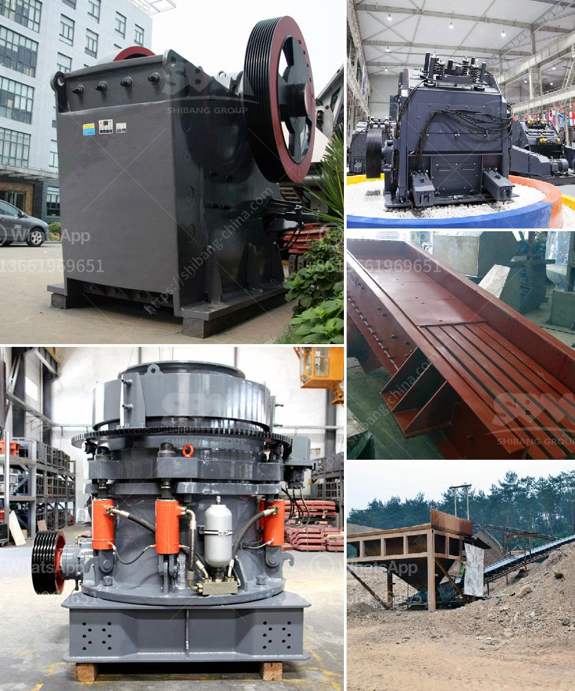

<h3>proposal usaha stone crusher</h3>
A stone crushing business is a lucrative venture for new entrepreneurs. The demand for quality stone chips is increasing day-by-day. The market potentiality of this business is high because the construction industry is prospering in every nook and corner of our country. Additionally, it is essential to have a strategic business plan and calculate the startup cost including business license, machinery, raw materials, staffing, and overhead expenses.

To set up stone crushing plant, it requires minimum investment cost and can be customized for different stone particle sizes. Therefore, a stone crusher plant with a capacity of 300-500 tons per hour is sought after by various projects.

To meet the different demands and requirements of customers, a stone crushing line can be equipped with appropriate machines including jaw crusher, impact crusher, and cone crusher. The existing stone crushers are unable to work properly, so we need to buy new stone crushers in order to produce in future.

Investment. We need stone crushers to process mineral resources, such as rocks and ores, and then we can get more economic benefits. What materials can Stone Crusher handle? Different models of stone crushers have different specifications, correspondingly, with different capacities and with it's character of flexible, it can be applied to different production requirements.

With the increasing demand for quality stone chips, and shortage of natural sand, artificial sand has become a trend. The design of a stone crushing production line is usually decided by several factors, including raw materials to be crushed, production capacity, and the final requirements.

These stone crushers are used for stone/mineral breaking and sand making for construction sites. To crush higher hardness materials such as pebbles, basalt, granite, etc., these crushers have been developed with higher capacity and efficiency. They are also stable in performance, easy to operate, and maintain. The market for stone crushing machines is restricted by design given the existence of many major manufacturers of building and industrial machinery worldwide. The industry's leading companies are embracing initiatives like mergers and acquisitions, collaborations, and partnerships to collaborate with other leading players in the industry and expand their geographical presence.

As a proposal for a stone crusher plant, it is reasoned that a stone crusher is at the core of the business operations. Single stage crushing units are expected to see growth in the coming years and this is estimated to open up new avenues for the stone crusher equipment manufacturers.

Stone crushing units have to monitor safe working practices and ensure the safety of workers and the nearby communities. The industry being a hazardous sector, employers have to put in place a workplace safety policy, conduct training sessions for employees, and monitor the implementation of these policies.

Overall, a stone crushing business is a profitable venture because it can be started with a small initial investment and has the potential to scale up to meet the growing demand. However, it is essential to invest in proper machinery and follow a well-defined business plan. By doing so, entrepreneurs can start earning significant profits from the very beginning.
<h3>Contact us</h3><ul><li><strong>Whatsapp:&nbsp;<a href="https://wa.me/8613661969651">+8613661969651</a></strong></li><li><a href="https://swt.shibang-china.com/?git&amp;zhl&amp;proposal usaha stone crusher"><strong>Online Service(chat now)</strong></a></li></ul><h3>Related</h3><ul><li><a href='stone crushing industry.md'>stone crushing industry</a></li><li><a href='coal vibration equipment size.md'>coal vibration equipment size</a></li><li><a href='mills for limestone in bolivia.md'>mills for limestone in bolivia</a></li><li><a href='south africa biggest chrome wash plant.md'>south africa biggest chrome wash plant</a></li><li><a href='manufacturer of vertical coal pulverizer mill.md'>manufacturer of vertical coal pulverizer mill</a></li></ul>