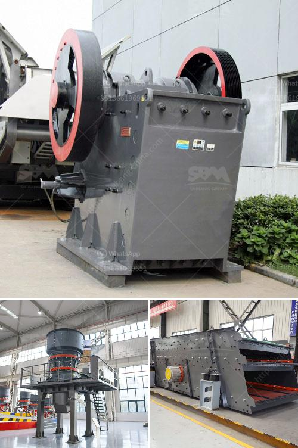

<h3>pulverizer crusher manufacturer in pune</h3>
Pune, also known as the "Oxford of the East," is a city in Maharashtra, India. It is renowned for its educational institutions, manufacturing industries, and a rapidly growing IT hub. Pune has become a prominent destination for various businesses, including the manufacturing sector. One such manufacturing industry that has gained a significant foothold in Pune is the pulverizer crusher.

A pulverizer crusher is a mechanical device used to grind various types of materials, turning them into fine powder or dust particles. These devices find applications in several industries, including mining, metallurgy, construction, pharmaceuticals, and others. In Pune, there are several manufacturers of pulverizer crushers, providing high-quality machines to cater to the diverse needs of different industries.

One of the leading pulverizer crusher manufacturers in Pune is ABC Machinery. They have been manufacturing and supplying a wide range of pulverizer crushers for over a decade. With their expertise and experience, they have established themselves as a reliable and trusted manufacturer in the market. Their pulverizer crushers are known for their durability, efficiency, and performance.

ABC Machinery's pulverizer crushers are designed to handle a variety of materials, including minerals, chemicals, ores, spices, construction materials, and more. They offer different types of crushers, such as jaw crushers, impact crushers, cone crushers, and hammer crushers, to meet the specific needs of their clients. These crushers are equipped with advanced features and technologies to ensure optimal performance and productivity.

The company also provides customized solutions to meet the unique requirements of their clients. Their team of engineers and technicians work closely with the clients to understand their needs and develop tailored solutions. Additionally, they offer comprehensive after-sales support, including installation, maintenance, and repairs.

ABC Machinery is committed to delivering high-quality pulverizer crushers at competitive prices. They strive to exceed customer expectations by providing innovative solutions and excellent customer service. Their dedication to quality and customer satisfaction has earned them a strong reputation in the industry.

In conclusion, if you are looking for a reliable pulverizer crusher manufacturer in Pune, ABC Machinery is a name you can trust. With their extensive experience, advanced technology, and commitment to customer satisfaction, they are a leading choice for industries seeking high-quality and efficient pulverizer crushers.
<h3>Contact us</h3><ul><li><strong>Whatsapp:&nbsp;<a href="https://wa.me/8613661969651">+8613661969651</a></strong></li><li><a href="https://swt.shibang-china.com/?git&amp;zhl&amp;pulverizer crusher manufacturer in pune"><strong>Online Service(chat now)</strong></a></li></ul><h3>Related</h3><ul><li><a href='ton per hour coal crushing plant.md'>ton per hour coal crushing plant</a></li><li><a href='copper crusher machine.md'>copper crusher machine</a></li><li><a href='used in cement plant.md'>used in cement plant</a></li><li><a href='cde sand wash plant for sale.md'>cde sand wash plant for sale</a></li><li><a href='ball mill suppliers in hyderabad.md'>ball mill suppliers in hyderabad</a></li></ul>