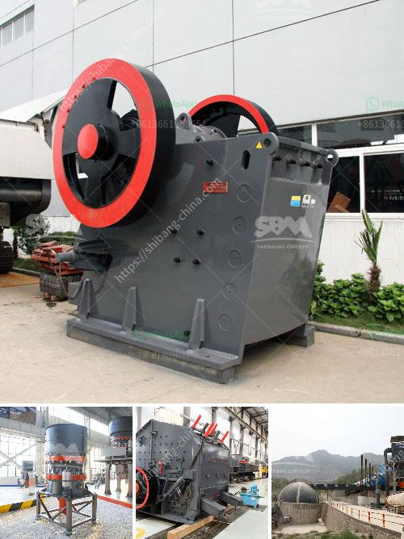

<h3>pulverizer machines manufacturers</h3>
Pulverizer machines are essential equipment in various industries that require size reduction of different materials. These machines are designed to crush, grind, or powder substances into smaller particles or granules, making them easier to handle, transport, or process.

In the vast market of pulverizer machines, there are many manufacturers producing high-quality equipment. These manufacturers play a crucial role in supplying reliable and efficient machines to industries across the globe.

One well-known manufacturer in this field is ABC Machinery. With years of experience in manufacturing pulverizer machines, ABC Machinery has become a trusted name in the industry. The company is committed to providing customers with top-quality machines that meet their specific requirements.

ABC Machinery offers a wide range of pulverizer machines, including hammer mills, impact pulverizers, and disc mills. These machines are designed to handle various types of materials, such as grains, minerals, herbs, spices, and more. The company's machines are known for their robust construction, high efficiency, and long-term durability, making them suitable for heavy-duty applications.

Another reputable manufacturer in the field of pulverizer machines is ZERMA. ZERMA is a German-based company with a global presence. The company specializes in the development and production of size reduction machinery for the plastics industry. ZERMA's pulverizer machines are widely used in recycling processes, where plastic waste is transformed into reusable materials.

ZERMA offers a range of pulverizer machines, including shredder systems, granulator machines, and pulverizer mills. These machines are designed to handle different types of plastic materials, such as PE, PP, PVC, and more. ZERMA's machines are known for their high performance, energy efficiency, and low maintenance requirements.

One more manufacturer worth mentioning is Hosokawa Micron. With over a century of experience in the industry, Hosokawa Micron is a leading provider of powder processing equipment. The company's pulverizer machines are designed to micronize various materials, such as powders, minerals, and chemicals, to achieve a specific particle size distribution.

Hosokawa Micron offers a wide range of pulverizer machines, including fluidized bed opposed jet mills, universal mills, and classifier mills. These machines are used in various industries, such as pharmaceuticals, food processing, and chemicals. Hosokawa Micron's machines are known for their versatility, precision, and reliability.

In conclusion, pulverizer machines are essential equipment in many industries that require size reduction of different materials. Manufacturers, such as ABC Machinery, ZERMA, and Hosokawa Micron, play a vital role in supplying top-quality machines that meet the specific requirements of their customers. These manufacturers' commitment to innovation, performance, and reliability has made them trusted names in the market of pulverizer machines.
<h3>Contact us</h3><ul><li><strong>Whatsapp:&nbsp;<a href="https://wa.me/8613661969651">+8613661969651</a></strong></li><li><a href="https://swt.shibang-china.com/?git&amp;zhl&amp;pulverizer machines manufacturers"><strong>Online Service(chat now)</strong></a></li></ul><h3>Related</h3><ul><li><a href='ball mill cement grinding.md'>ball mill cement grinding</a></li><li><a href='stone crusher plant sweden.md'>stone crusher plant sweden</a></li><li><a href='double roller crusher advantages.md'>double roller crusher advantages</a></li><li><a href='how much is a ball mill.md'>how much is a ball mill</a></li><li><a href='crushers of jaw china.md'>crushers of jaw china</a></li></ul>