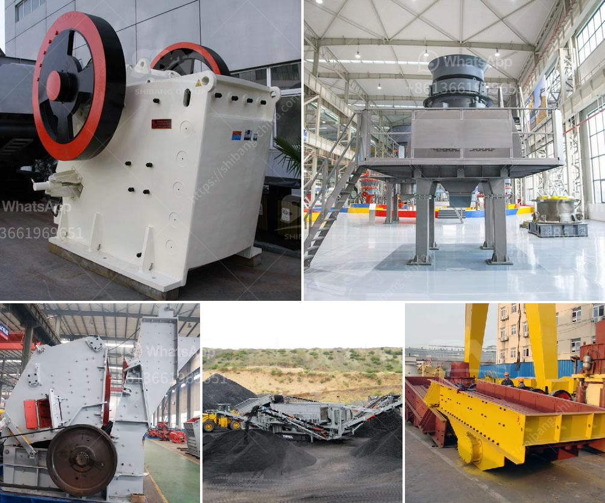

<h3>pulviriser machine in allahabad</h3>
Allahabad, located in the heart of Uttar Pradesh, is renowned for its industrial development and thriving manufacturing sector. One machinery that has gained significant popularity in Allahabad's industries is the pulveriser machine. This versatile appliance has revolutionized various sectors with its exceptional efficiency and capability. From agriculture to food processing, chemical to pharmaceutical and construction to mining, the pulveriser machine has proven to be a game-changer for businesses in Allahabad.

The pulveriser machine is a robust mechanical device employed in Allahabad's manufacturing units. Its primary function is to crush, grind, and pulverize raw materials into fine powders. The machine can handle a wide range of materials, including grains, spices, herbs, chemicals, minerals, and even construction materials like cement and concrete. This adaptability is a significant advantage for industries in Allahabad, allowing them to streamline their production processes and create a myriad of products.

Allahabad is known for its fertile soil and vast agricultural land. The pulveriser machine has emerged as an essential tool for farmers and agricultural businesses in the region. It aids in the conversion of grains, such as wheat, rice, and corn, into flour or animal feed. The machine's precision allows for consistent grinding, resulting in high-quality products. Additionally, the pulveriser machine enables the agricultural sector to efficiently process herbs and medicinal plants, promoting the production of organic fertilizers, animal supplements, and herbal remedies in Allahabad.

In the chemical and pharmaceutical sector, the pulveriser machine plays a vital role in refining and extracting raw materials. Through precise grinding, the machine ensures uniform particle sizes and consistent composition, contributing to the production of pharmaceutical drugs, chemicals, and dyes. Furthermore, the machine's capability to grind minerals, such as limestone, gypsum, and talc, makes it indispensable in Allahabad's construction and mining industries. It aids in the creation of materials used in infrastructure development, cement production, and even cosmetic products.

The pulveriser machine offers several advantages to industries in Allahabad. Its high-speed operation, low maintenance requirements, and energy efficiency make it an ideal choice for businesses aiming to enhance productivity and reduce operational costs. Additionally, its compact size allows for easy installation, even in limited workspaces. With its diverse applications and exceptional functionality, the pulveriser machine has become a game-changer for industries in Allahabad, empowering them to boost their output, improve overall quality, and meet the ever-increasing demand. As the city's manufacturing sector continues to grow, the pulveriser machine will undoubtedly remain a cornerstone of industrial development in Allahabad.
<h3>Contact us</h3><ul><li><strong>Whatsapp:&nbsp;<a href="https://wa.me/8613661969651">+8613661969651</a></strong></li><li><a href="https://swt.shibang-china.com/?git&amp;zhl&amp;pulviriser machine in allahabad"><strong>Online Service(chat now)</strong></a></li></ul><h3>Related</h3><ul><li><a href='18 36 inch jaw crusher plant in south africa.md'>18 36 inch jaw crusher plant in south africa</a></li><li><a href='screening machine for sale south africa.md'>screening machine for sale south africa</a></li><li><a href='malaysia stone crusher price.md'>malaysia stone crusher price</a></li><li><a href='famous manganese cone crusher parts made in luoyang china.md'>famous manganese cone crusher parts made in luoyang china</a></li><li><a href='iron ore crushing equipment cost.md'>iron ore crushing equipment cost</a></li></ul>