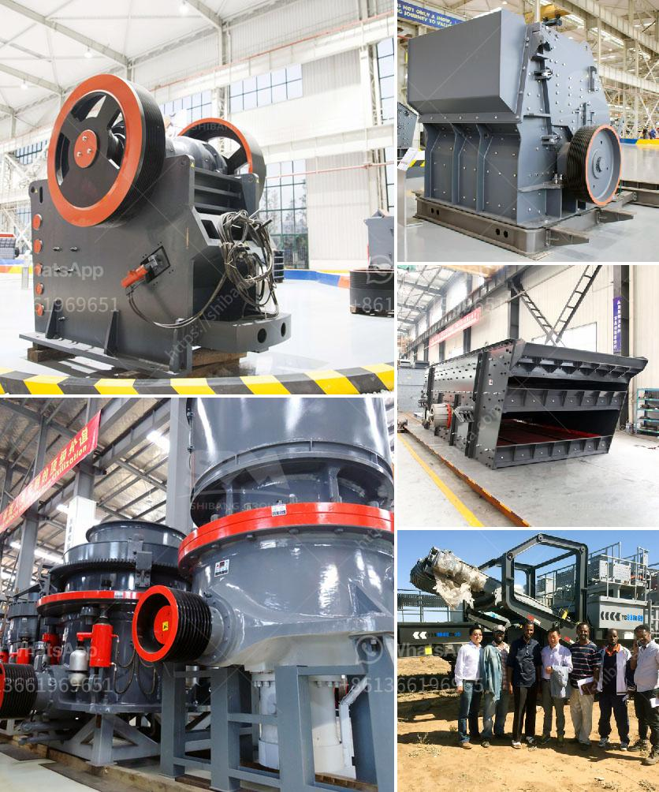

<h3>puzzolana stone crusher 100tph</h3>
Puzzolana stone crusher 100tph(50 Tph Model) with Integrated Feeder Hopper, Grizzly feeder and Vibro screen is generally used as a Secondary or Tertiary Crusher. The cone crusher's working principle is to break the material by compression, by squeezing it between its mantle and bowl liner, which is receding from the inlet opening.

The large stone crusher is an advanced technology of the recent era, and it is widely used in the crushing process of various materials. The capacity of this Stone Crusher ranges from 50 TPH to 100 TPH. This model machine is equipped with an integrated Feeder, Hopper, Grizzly feeder, and Vibro screen. These machines are used together for feeding, screening, primary and secondary crushing purpose.

The Feeder is built with an automatic control panel that regulates the feed rate from the hopper. The Hopper has a capacity of 4.5m3, which ensures uninterrupted feeding of the stone into the crushing chamber. The Grizzly Feeder helps to separate the fines and unwanted materials before they enter the Jaw Crusher. This ensures the high efficiency of the crusher and reduces the wear and tear on the crusher components. The Vibro screen is used to separate crushed stone particles into different size categories, depending on the requirements of the specific project.

The Puzzolana stone crusher 100tph has a unique design with a central shaft that moves horizontally and vertically. So, with this movement, different crushing zones are formed. The width between the side plates of the main body determines the capacity of the crusher. The feed size is usually up to 400mm, and the output size of the crushed material can be adjusted from 20mm to 80mm. The size and shape of the product are determined by the crusher setting and the speed of the machine.

The Puzzolana stone crusher runs on a 250 HP motor and requires a feed rate of 250TPH. It can handle soft rocks with a compression strength ranging from 0-320MPa. It has the ability to crush harder rocks and can handle capacities up to 600 TPH.

In conclusion, Puzzolana stone crusher 100tph is suitable for crushing all kinds of rocks with compressive strength less than 320MPa. It can be used as a primary or secondary crusher in mining and construction industries. The feed size can range from 200mm to 450mm, depending on the model and capacity. The machine has a sturdy construction, efficient crushing capacity, and low operating costs, making it a popular choice among customers.
<h3>Contact us</h3><ul><li><strong>Whatsapp:&nbsp;<a href="https://wa.me/8613661969651">+8613661969651</a></strong></li><li><a href="https://swt.shibang-china.com/?git&amp;zhl&amp;puzzolana stone crusher 100tph"><strong>Online Service(chat now)</strong></a></li></ul><h3>Related</h3><ul><li><a href='quartz powder machine.md'>quartz powder machine</a></li><li><a href='gravel crushing machine.md'>gravel crushing machine</a></li><li><a href='rock crusher distributors in phillipinwes.md'>rock crusher distributors in phillipinwes</a></li><li><a href='price of roller crusher.md'>price of roller crusher</a></li><li><a href='ultra white silica processing.md'>ultra white silica processing</a></li></ul>