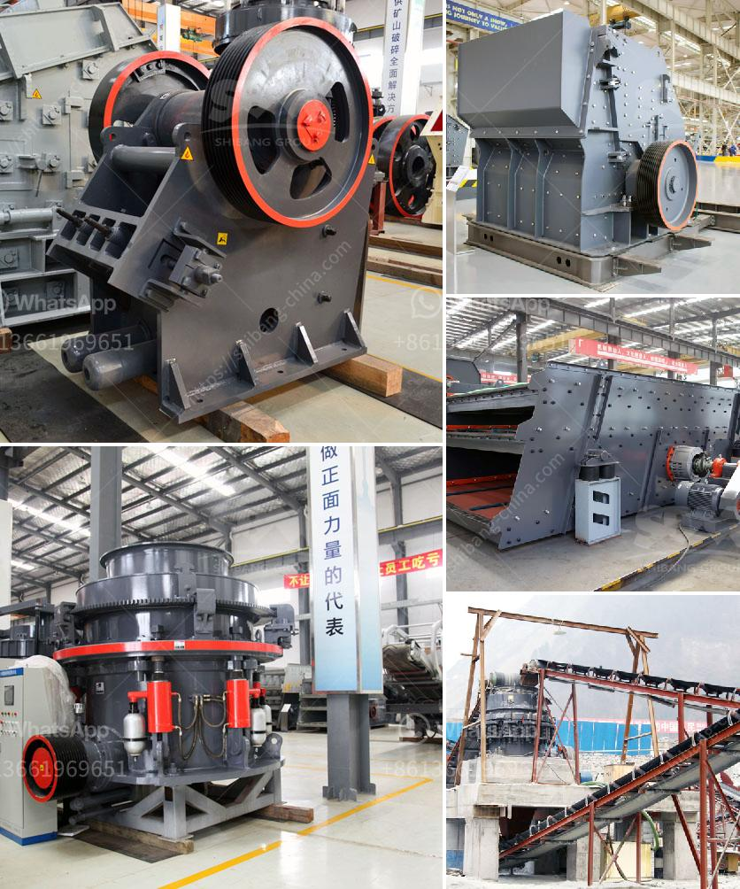

<h3>quarry crusher for sales in germany</h3>
Germany’s construction industry is witnessing a significant growth spurt, driving the demand for high-quality aggregates. These aggregates serve as the building blocks for infrastructure development, ranging from roadways and bridges to residential and commercial projects. As a result, the need for efficient equipment, such as quarry crushers, has become paramount in meeting this growing demand.

Quarry crushers play a pivotal role in the extraction and processing of raw materials that are essential for various construction purposes. They enable the transformation of large rocks into smaller sizes, making them suitable for use in concrete, asphalt, and other construction materials. Germany, being one of Europe's largest economies and a hub for construction activities, has a robust market for quarry crusher sales.

One of the primary advantages of quarry crushers is their ability to process a wide range of materials, including minerals, ores, and rocks of different hardness levels. This versatility makes them invaluable in the construction industry. Additionally, they come in various types, including jaw crushers, cone crushers, and impact crushers. Each type offers unique features and benefits, allowing construction companies to choose the equipment best suited to their specific needs.

German manufacturers of quarry crushers are known for their engineering excellence and technological advancements. They have developed specialized equipment that is efficient, durable, and environmentally friendly. German quarry crushers are designed to minimize energy consumption and reduce emissions. This commitment to sustainability has made them highly sought after by construction companies around the world.

Furthermore, German quarry crushers are backed by comprehensive after-sales services, including maintenance, repairs, and spare parts management. This ensures that the equipment remains in optimal condition throughout its lifespan, maximizing its operational efficiency. Additionally, manufacturers provide technical support and training to enable construction companies to fully utilize the capabilities of their quarry crushers.

When investing in quarry crushers, construction companies can expect a significant return on investment. These crushers have high production capacities, enabling them to process large volumes of materials in a relatively short time. This increases productivity, reduces costs, and allows construction projects to be completed on schedule. Moreover, the resale value of German quarry crushers remains high due to their reputation for quality and reliability.

In conclusion, quarry crushers have become an essential asset for construction companies in Germany. Their ability to process a wide range of materials, coupled with their energy efficiency and sustainability, makes them indispensable in the construction industry. German quarry crushers, in particular, offer superior quality, backed by comprehensive after-sales services. Investing in these crushers provides construction companies with a sustainable and profitable solution to meet the growing demand for aggregates. As construction activities continue to thrive in Germany, quarry crushers will play a pivotal role in shaping the nation's infrastructure.
<h3>Contact us</h3><ul><li><strong>Whatsapp:&nbsp;<a href="https://wa.me/8613661969651">+8613661969651</a></strong></li><li><a href="https://swt.shibang-china.com/?git&amp;zhl&amp;quarry crusher for sales in germany"><strong>Online Service(chat now)</strong></a></li></ul><h3>Related</h3><ul><li><a href='slag crushing plant.md'>slag crushing plant</a></li><li><a href='roller stone crusher.md'>roller stone crusher</a></li><li><a href='limestone production process.md'>limestone production process</a></li><li><a href='ball grinding mill.md'>ball grinding mill</a></li><li><a href='stone crush machine price in pakistan.md'>stone crush machine price in pakistan</a></li></ul>