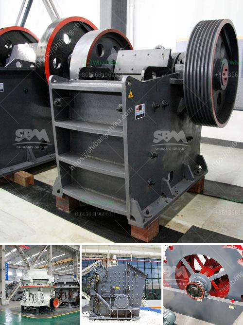

<h3>quarry crusher philippines</h3>
The Philippines is a mountainous country with a rich geological heritage. Therefore, it is the ideal place for quarrying and mining activities. But what constitutes an effective quarry crusher Philippines? As the name suggests, it is a machine used to crush large rocks and stones into smaller particles. Ever since its invention, it has been utilized in a variety of industries, such as mining, construction, metallurgy, aerospace, and many more.

At its core, a quarry crusher is made up of two parts: the primary crusher and the secondary crusher. The primary crusher is responsible for reducing the size of the materials that are brought in from the quarry. This process is essential as the stones need to be small enough to fit in certain machines such as loaders and dump trucks. On the other hand, the secondary crusher further reduces the size of the particles into a more manageable size for further processing.

One of the significant advantages of using a quarry crusher is its versatility. It can handle various types of materials, such as limestone, granite, basalt, river pebbles, and even ores like copper and gold. This makes it a useful tool not only for the industry but also for environmental preservation. When used correctly, quarry crushers can help extract valuable resources while minimizing the impact on the environment.

Another crucial aspect of a quarry crusher Philippines is its energy efficiency. With advancements in technology, modern crushers are now designed to consume less energy compared to traditional ones. This is achieved through the use of better materials, improved engineering, and intelligent systems that optimize the operation. By reducing energy consumption, quarry crushers can help businesses save on operational costs, making it a more sustainable choice in the long run.

Safety is always a top priority in any construction or mining site. Quarry crushers are equipped with various safety features to ensure not only the protection of the workers but also the machinery itself. These safety mechanisms include overload and overheat protection, emergency stop buttons, and guards. In addition, many quarry crushers are also equipped with advanced control systems that offer real-time monitoring and diagnostics to detect any potential issues promptly. This allows for preventive maintenance to be done, ultimately extending the lifespan of the machine.

In conclusion, a quarry crusher Philippines is an indispensable piece of equipment in the construction industry. It enables efficient processing of different materials, saves time and money, and ensures safety on-site. However, choosing the right quarry crusher supplier is crucial. To ensure the quality and reliability of the equipment, it is essential to work with reputable manufacturers who have a track record of delivering durable and high-performance quarry crushers. By investing in a reliable and efficient quarry crusher, businesses can maximize productivity, reduce downtime, and ultimately achieve their construction goals.
<h3>Contact us</h3><ul><li><strong>Whatsapp:&nbsp;<a href="https://wa.me/8613661969651">+8613661969651</a></strong></li><li><a href="https://swt.shibang-china.com/?git&amp;zhl&amp;quarry crusher philippines"><strong>Online Service(chat now)</strong></a></li></ul><h3>Related</h3><ul><li><a href='raymond mill mumbai and africa.md'>raymond mill mumbai and africa</a></li><li><a href='to do with the stone crusher.md'>to do with the stone crusher</a></li><li><a href='to choose jaw crusher.md'>to choose jaw crusher</a></li><li><a href='calcite manufacturing.md'>calcite manufacturing</a></li><li><a href='vertical hammer crusher.md'>vertical hammer crusher</a></li></ul>