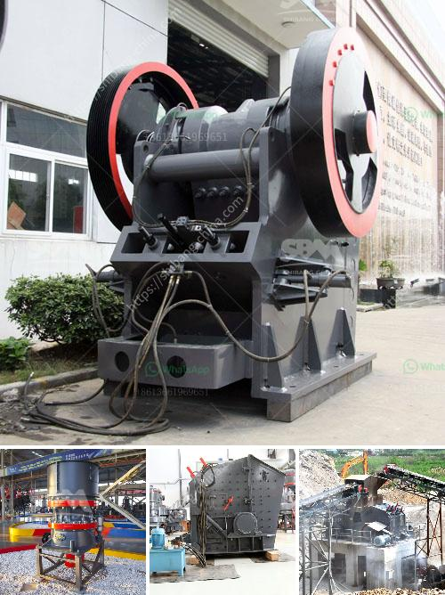

<h3>quarry crusher zimbabwe</h3>
Zimbabwe is rich in various mineral resources, including gold, chromium, asbestos, lithium, and coal, among others. The mining industry provides countless job opportunities and contributes greatly to the country's economic growth. One crucial aspect of mining operations is quarrying, which involves extracting raw materials from the earth's surface to be used in construction, manufacturing, and other industries. As such, investing in a reliable quarry crusher in Zimbabwe is a wise decision for any mining company.

A quarry crusher is a machine used to break down large stones into smaller pieces. These machines come in different configurations and sizes. The crushing process involves feeding the stones into the crusher chamber accompanied by a mechanical pressure to achieve the desired output size. The crushed stones can then be reused in various applications, such as making concrete, road construction, or aggregated for further processing.

In Zimbabwe, the mining industry heavily relies on quarry crushers to process various minerals. Choosing the right crusher for your quarry operation is essential to ensure efficiency, productivity, and cost-effectiveness. Several factors should be considered when deciding which crusher is the most suitable solution for your specific needs.

Firstly, the material's hardness and density play a significant role in determining the type of crusher required. For instance, materials with high hardness, such as granite or basalt, are best processed with a jaw crusher, whereas softer materials like limestone or dolomite can be efficiently crushed by impact crushers or cone crushers.

Secondly, the targeted output size is also crucial because different crushers are designed to produce specific size ranges. If you require finer output, a cone crusher might be suitable, while a jaw crusher is more suitable for coarser outputs. The throughput capacity is another consideration, as it determines how much material the crusher can handle within a given time frame.

Furthermore, the crusher's design and features should also be assessed. Look for crushers with features that enhance safety, ease of maintenance, and reliability. Additionally, considering factors such as power consumption, noise levels, and dust control mechanisms can help mitigate potential environmental issues associated with quarrying.

In Zimbabwe, there are several reputable manufacturers and suppliers of quarry crushers. These companies provide a range of crushers that cater to various mining requirements. Engaging with a trusted supplier ensures you receive high-quality equipment and reliable after-sales support, including spare parts availability and technical assistance.

Investing in a quarry crusher in Zimbabwe is a long-term commitment that requires careful consideration. To optimize your crushing process, it is crucial to understand your specific needs, choose the right crusher based on material characteristics and desired output, and partner with reputable suppliers.

In conclusion, quarry crushers in Zimbabwe play a vital role in the mining industry by efficiently breaking down large stones into smaller pieces that can be used in various construction projects. To make the most of your investment, conduct thorough research, consider your requirements, and select a crusher that will help you achieve your operational goals. By doing so, you can enhance productivity, reduce costs, and contribute to Zimbabwe's overall economic growth.
<h3>Contact us</h3><ul><li><strong>Whatsapp:&nbsp;<a href="https://wa.me/8613661969651">+8613661969651</a></strong></li><li><a href="https://swt.shibang-china.com/?git&amp;zhl&amp;quarry crusher zimbabwe"><strong>Online Service(chat now)</strong></a></li></ul><h3>Related</h3><ul><li><a href='mobile stone crusher 120 tph price.md'>mobile stone crusher 120 tph price</a></li><li><a href='limestone crusher equipment.md'>limestone crusher equipment</a></li><li><a href='ball mill to buy in peru.md'>ball mill to buy in peru</a></li><li><a href='format of the business plan for stone crusher.md'>format of the business plan for stone crusher</a></li><li><a href='roller mill for powders.md'>roller mill for powders</a></li></ul>