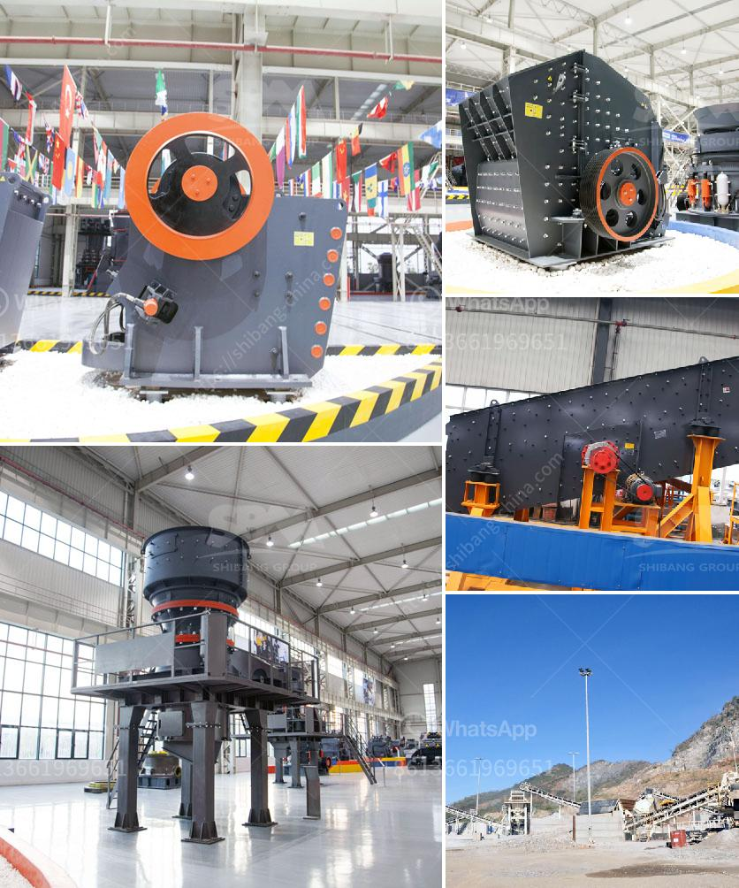

<h3>quarry crushing line</h3>
In today's rapidly growing world, the demand for construction materials is skyrocketing. As cities and infrastructure continue to expand, the need for aggregates such as sand, gravel, and crushed stone is at an all-time high. To meet this rising demand, quarry crushing lines are being established to ensure a steady supply of quality aggregates.

A quarry crushing line refers to the whole set of granite stone crushing machines that are employed to process rocks and produce gravels. With the increasing demand for construction aggregates, the importance of quarrying equipment cannot be underestimated. In essence, a quarry crushing line plays a vital role in the smooth operation of any quarry site.

The first step in a quarry crushing line involves blasting the rock into smaller fragments. This is achieved through controlled explosions, which break the rocks into manageable sizes. Once the fragmented rocks are extracted, they are loaded onto massive haul trucks and transported to the primary crusher.

The primary crusher is a heavy-duty machine that breaks the rocks into small fragments. It is capable of handling large quantities of material and reducing them into manageable sizes. The crushed rocks then move onto the secondary and tertiary crushers, where further reduction takes place.

In addition to crushers, quarry crushing lines also comprise various screening and conveying equipment. Screens are used to segregate different sizes of aggregates, ensuring that only the desired products are processed. Conveyors transport the materials from one stage to another, eliminating the need for manual handling.

One of the key components of a successful quarry crushing line is the quality and efficiency of the equipment being used. Modern crushing machines are equipped with advanced technologies such as hydraulic systems, automated controls, and computerized monitoring. These features optimize productivity, minimize downtime, and ensure consistent product quality.

Furthermore, environmental considerations are also an essential part of a quarry crushing line. Dust suppression systems, water sprayers, and soundproof enclosures are employed to mitigate the impact of dust and noise pollution. Additionally, the efficient use of energy and water is prioritized to minimize the ecological footprint.

As the population grows and urbanization expands, the demand for construction materials will only continue to rise. Quarry crushing lines are crucial in meeting this demand by providing a constant supply of aggregates. These materials are essential for constructing roads, buildings, bridges, and various other structures that support our modern way of life.

In conclusion, quarry crushing lines are indispensable components of the construction industry. The extraction and processing of aggregates ensure a consistent supply of construction materials required for urban development. By utilizing advanced equipment, implementing environmental measures, and optimizing operational efficiency, quarry crushing lines play a vital role in meeting the rising demand for aggregates.
<h3>Contact us</h3><ul><li><strong>Whatsapp:&nbsp;<a href="https://wa.me/8613661969651">+8613661969651</a></strong></li><li><a href="https://swt.shibang-china.com/?git&amp;zhl&amp;quarry crushing line"><strong>Online Service(chat now)</strong></a></li></ul><h3>Related</h3><ul><li><a href='stone crushing industry.md'>stone crushing industry</a></li><li><a href='semi industrial stone crusher.md'>semi industrial stone crusher</a></li><li><a href='chilli crushing machine project report.md'>chilli crushing machine project report</a></li><li><a href='portable crusher manufacturer.md'>portable crusher manufacturer</a></li><li><a href='coal crusher design.md'>coal crusher design</a></li></ul>