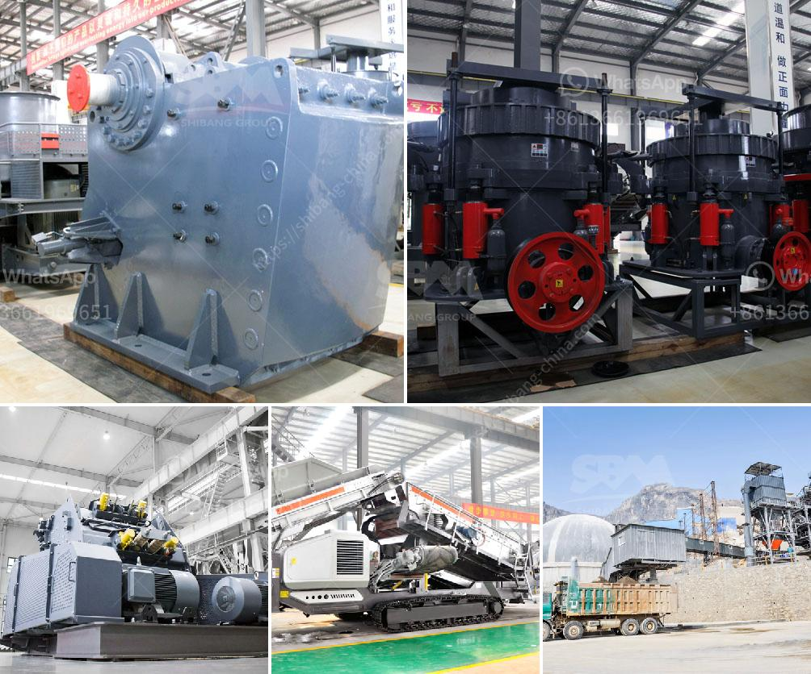

<h3>quarry crushing plants in south africa</h3>
Quarrying is a vital activity that involves the extraction of raw materials for various construction purposes. With the booming construction industry, demand for quarry crushing plants in South Africa is increasing rapidly.

Quarrying is a mining process that exploits open pit or underground deposits. To extract stone, minerals or aggregates from the earth, it is necessary to crush and grind the rock into various sizes. Quarry crushing plants can be fixed or mobile. The process of crushing rock always starts with the material being extracted, and then transported to the crushing plant.

In a quarry crushing plant, primary crushing is done using one or more jaw crushers. These crushers act as the first stage of material reduction in the crushing process. Depending on the desired output size of the material, the jaw crushers can be configured in different sizes and capacities.

Secondary crushing in a quarry crushing plant involves the use of cone crushers. These crushers are further used to break down the material into finer size. The final stage of crushing in a quarry crushing plant is the tertiary crushing. Tertiary crushers are used to produce finely crushed material when further reduction is needed past primary and secondary crushing.

South Africa is fortunate to have natural significant reserves of limestone. The limestone quarries have valuable resources which are used in the production of many products. This means this is good opportunity for employment creation. Quarries that are no longer of use can be turned into an entertainment area, where people can do 'rock climbing'. On the other hand, these quarries are large and visible. If not managed properly they can disfigure the local environment and cause pollution which is hazardous to the environment.

Quarry crushing plants in South Africa are typically designed to provide a more profitable and efficient operation. These plants are well-equipped and have reliable performance to consistently produce quality materials. Those who want to invest in a quarry crushing plant, like South Africa, can consult us for further details and benefits.
<h3>Contact us</h3><ul><li><strong>Whatsapp:&nbsp;<a href="https://wa.me/8613661969651">+8613661969651</a></strong></li><li><a href="https://swt.shibang-china.com/?git&amp;zhl&amp;quarry crushing plants in south africa"><strong>Online Service(chat now)</strong></a></li></ul><h3>Related</h3><ul><li><a href='zinc ore processing plant.md'>zinc ore processing plant</a></li><li><a href='small rock crusher australia.md'>small rock crusher australia</a></li><li><a href='sand screener and washer.md'>sand screener and washer</a></li><li><a href='manufacturers of 3 tph vertical roller mill in china.md'>manufacturers of 3 tph vertical roller mill in china</a></li><li><a href='ballast crusher sale kenya.md'>ballast crusher sale kenya</a></li></ul>