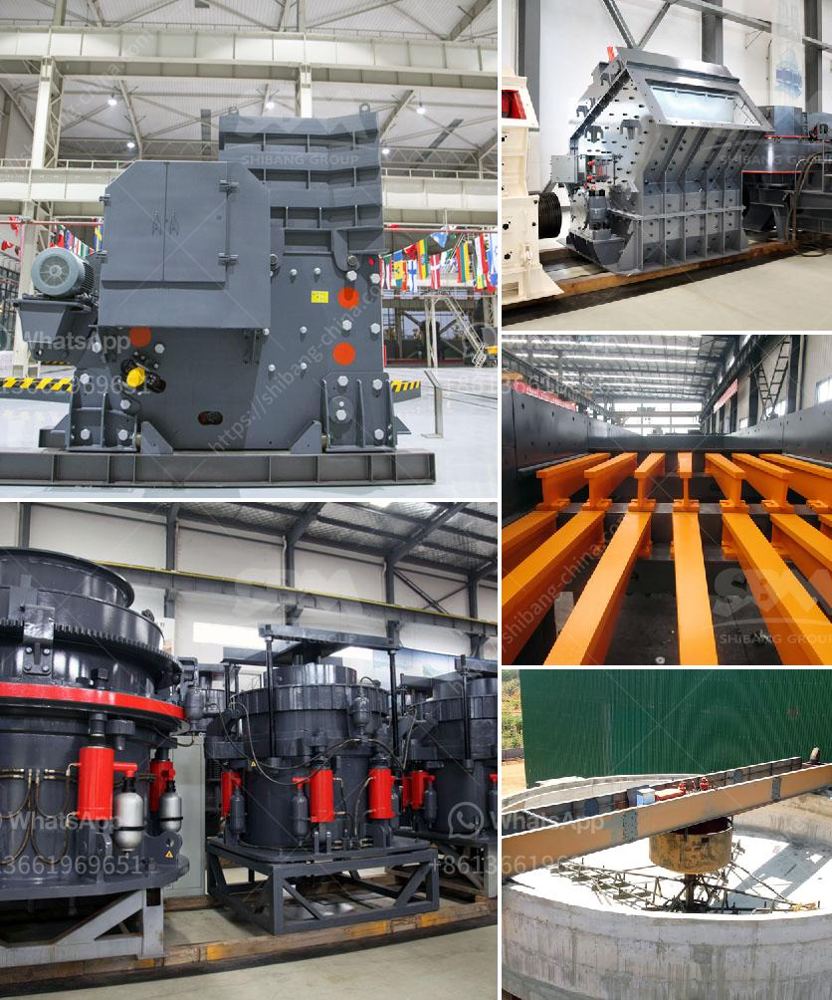

<h3>quarry machines repairing centre in chennai</h3>
The mining industry greatly relies on the efficiency and functionality of quarry machines to extract valuable minerals from the earth's surface. However, the heavy workload and harsh working conditions often result in wear and tear, leading to the need for timely repairs and maintenance. In Chennai, the bustling capital city of Tamil Nadu, a range of specialized quarry machine repairing centres have emerged to cater to the growing needs of the mining industry.

With the introduction of advanced technologies and state-of-the-art machinery, quarry machine repairing centres in Chennai have become synonymous with reliability and expertise. Equipped with cutting-edge tools and experienced technicians, these centres excel in diagnosing and fixing various mechanical, hydraulic, and electrical issues that commonly afflict quarry equipment.

The repairing centres in Chennai boast a skilled workforce that combines technical know-how with practical experience in handling diverse quarry machines. These professionals are well-versed in identifying and rectifying even the most complex problems, ensuring minimal downtime for mining operations. Moreover, their expertise extends beyond repair and encompasses preventive maintenance, which plays a vital role in increasing the lifespan of quarry machines, reducing operational costs, and enhancing productivity.

One of the key advantages of quarry machine repairing centres in Chennai is their commitment to providing timely servicing and maintenance. Recognizing the urgency of repairs in the mining sector, these centres prioritize their response time to minimize disruptions and keep operations running smoothly. They also maintain an extensive inventory of spare parts, ensuring quick and efficient replacements whenever required. This commitment to prompt service has earned the trust of mining companies, leading to long-term partnerships with the quarry machine repairing centres.

Chennai's quarry machine repairing centres understand the financial constraints faced by the mining industry. Therefore, they prioritize offering cost-effective solutions without compromising on quality. The centres work closely with mining companies, understanding their specific requirements and customizing repair services accordingly. This personalized approach ensures that the repaired quarry machines are tailored to the unique needs of each mining operation, maximizing their efficiency and longevity.

The presence of quarry machine repairing centres in Chennai has provided a reliable solution for the mining industry in need of repairs and maintenance. With their advanced facilities, skilled workforce, timely servicing, and cost-effective solutions, these centres have become vital partners for mining companies. Moving forward, as the mining sector continues to grow, the significance of such repairing centres in Chennai will only become more pronounced, driving the industry towards increased productivity and profitability.
<h3>Contact us</h3><ul><li><strong>Whatsapp:&nbsp;<a href="https://wa.me/8613661969651">+8613661969651</a></strong></li><li><a href="https://swt.shibang-china.com/?git&amp;zhl&amp;quarry machines repairing centre in chennai"><strong>Online Service(chat now)</strong></a></li></ul><h3>Related</h3><ul><li><a href='how much is mobile crusher rock.md'>how much is mobile crusher rock</a></li><li><a href='calcium carbonate crushing machine.md'>calcium carbonate crushing machine</a></li><li><a href='small scale mining partnership crusher.md'>small scale mining partnership crusher</a></li><li><a href='10 inches marble grinding stone.md'>10 inches marble grinding stone</a></li><li><a href='iron ore crushing equipment cost.md'>iron ore crushing equipment cost</a></li></ul>