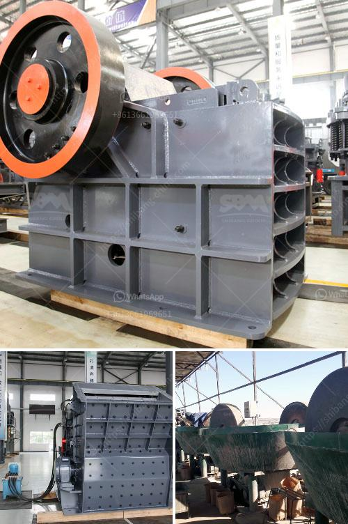

<h3>quartz ball for ball milling</h3>
In the world of ore grinding and milling, choosing the right equipment is crucial to ensure that you are maximizing the efficiency of your operation. One essential tool in this process is the quartz ball used in ball milling, which provides optimal grind and exceptional performance in various applications. Let's explore the power and potential of this indispensable component.

Quartz balls are commonly employed in the ball milling process due to their unique properties. They are made from high-quality, pure quartz, a naturally occurring mineral that has excellent hardness and wear resistance. Its abundance and low cost make quartz a desirable material in many industries, particularly those involved in grinding and milling operations.

When used in ball milling, quartz balls enable efficient particle size reduction and help achieve a desired grind. The crushing and grinding of ores and materials require the generation of frictional forces to break them down into smaller particles. Quartz balls provide this necessary friction by acting as a medium through which the energy is transferred to the material being ground.

One of the key advantages of quartz balls is their exceptional hardness. With a Mohs hardness rating of 7, equal to that of granite and higher than most metals, quartz balls are highly resistant to wear and abrasion. This property ensures that they retain their shape and structure even under demanding conditions, delivering consistent and reliable performance.

Another important feature of quartz balls is their high resistance to chemical corrosion. They are unaffected by most acids and alkalis, making them suitable for use in a wide variety of environments and processes. This resistance to chemical attack ensures that the quartz balls maintain their integrity and do not contaminate the materials being milled.

In addition to their mechanical and chemical properties, quartz balls offer excellent thermal stability. They can withstand high temperatures without undergoing significant thermal expansion or contraction. This property is particularly important in applications where the milling process involves heat generation, preventing any adverse effects on performance or accuracy.

The size and shape of quartz balls can vary depending on the specific milling requirements. They are available in various diameters and can be customized to meet the desired particle size distribution and grind characteristics. This flexibility allows for precise control over the milling process, ensuring optimal results and enabling the production of fine powders with the desired properties.

Quartz balls find extensive use in industries such as mining, ceramics, paints, pigments, and chemical manufacturing, where particle size reduction is vital for product quality and performance. They are commonly used in ball mills, attrition mills, and other grinding equipment to achieve the desired grind and particle size distribution.

In conclusion, quartz balls play a vital role in the ball milling process, offering exceptional hardness, wear resistance, chemical stability, and thermal properties. Their use in grinding and milling operations ensures efficient particle size reduction and precise control over the grind characteristics. Whether it's in mining or other industries that rely on fine particle size reduction, quartz balls are indispensable for optimizing performance and achieving desired results.
<h3>Contact us</h3><ul><li><strong>Whatsapp:&nbsp;<a href="https://wa.me/8613661969651">+8613661969651</a></strong></li><li><a href="https://swt.shibang-china.com/?git&amp;zhl&amp;quartz ball for ball milling"><strong>Online Service(chat now)</strong></a></li></ul><h3>Related</h3><ul><li><a href='rock crushing equipment for sale.md'>rock crushing equipment for sale</a></li><li><a href='manufacturers of coal mill in india.md'>manufacturers of coal mill in india</a></li><li><a href='custom milling for small scale mining.md'>custom milling for small scale mining</a></li><li><a href='limestone plant manufacturer in turkey.md'>limestone plant manufacturer in turkey</a></li><li><a href='best wash plant for gold mining.md'>best wash plant for gold mining</a></li></ul>