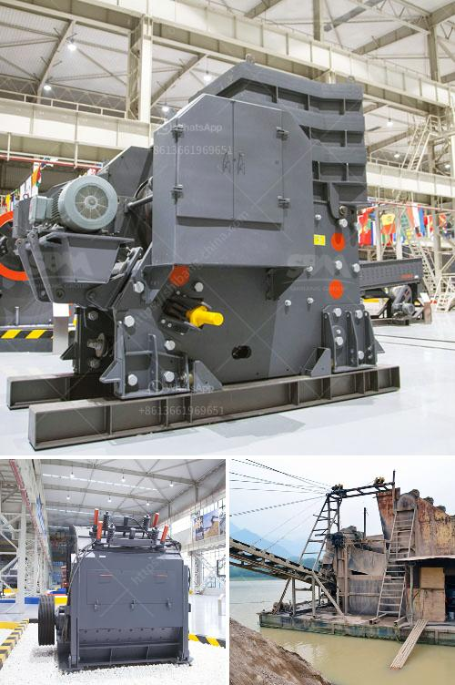

<h3>quartz crusher machinery</h3>
Quartz is a mineral that has many uses. It is widely used in various industries such as glass, ceramics, and electronics. To make quartz usable in these industries, it needs to be crushed and processed into smaller pieces. This is where a quartz crusher machinery comes in.

A quartz crusher machinery is an essential piece of equipment in the stone crushing plant, machinery used for quartz crushing includes Jaw Crusher, Cone Crusher, Impact Crusher, and Mobile Crusher. The quartz crusher machinery is used to crush quartz into smaller sizes for different applications. It is considered as an essential piece of machinery in the mining and construction industry.

The quartz crusher machinery has a variety of different types and sizes for different applications. They can also be used as standalone machines or as part of a larger system. Some of the most common types of quartz crusher machinery include jaw crusher, cone crusher, impact crusher, and mobile crusher.

A jaw crusher is designed to crush large pieces of quartz into smaller pieces. It has a fixed jaw and a moving jaw. The moving jaw moves back and forth to crush the quartz against the fixed jaw. This type of crusher is usually used as a primary crusher in a crushing plant.

A cone crusher is another type of quartz crusher machinery. It is used to crush quartz into smaller sizes. The quartz is fed into the crusher through a vibrating feeder. The cone crusher crushes the quartz by rotating the shaft and applying pressure to the quartz until it breaks into smaller pieces.

An impact crusher is also commonly used to crush quartz. It uses a high-speed rotor to crush the quartz against a hard surface. The quartz is fed into the crusher from above and is crushed by the rotor as it spins at high speeds. The crushed quartz then falls onto a conveyor belt where it is transported to the next stage of the crushing process.

Lastly, a mobile crusher is a type of quartz crusher machinery that is mounted on a trailer or truck. It can be easily transported to different locations, making it ideal for mining and construction sites where the quartz needs to be crushed.

In conclusion, a quartz crusher machinery is a vital piece of equipment in the stone crushing plant. It is used to crush quartz into smaller sizes for various applications. There are different types and sizes of quartz crusher machinery available, including jaw crushers, cone crushers, impact crushers, and mobile crushers. These machines are essential in the mining and construction industry for processing quartz efficiently.
<h3>Contact us</h3><ul><li><strong>Whatsapp:&nbsp;<a href="https://wa.me/8613661969651">+8613661969651</a></strong></li><li><a href="https://swt.shibang-china.com/?git&amp;zhl&amp;quartz crusher machinery"><strong>Online Service(chat now)</strong></a></li></ul><h3>Related</h3><ul><li><a href='brand of ball mills.md'>brand of ball mills</a></li><li><a href='crusehr processing plant malaysia.md'>crusehr processing plant malaysia</a></li><li><a href='grinding roller mill machine.md'>grinding roller mill machine</a></li><li><a href='manufacturing processes of clay products.md'>manufacturing processes of clay products</a></li><li><a href='buy stone crusher machine in saudi arabia.md'>buy stone crusher machine in saudi arabia</a></li></ul>