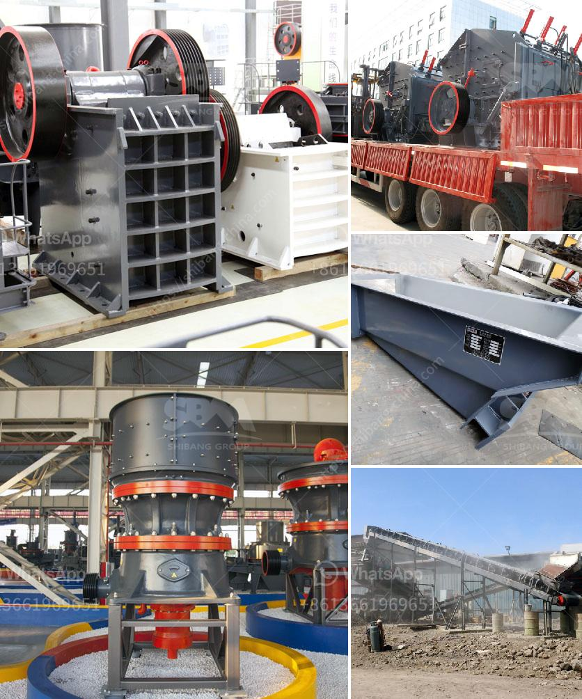

<h3>quartz plass grinder price</h3>
Quartz glass grinders have become increasingly popular in recent years due to their durability and efficiency in grinding various materials. These grinders are particularly known for their ability to grind herbs, spices, and other dry substances into fine particles. Not only do they provide a consistent grind, but they also ensure the preservation of the aromas and flavors of the materials being ground. However, with the growing demand for these products, it is important to understand the factors that affect their pricing.

One key factor that contributes to the price of quartz glass grinders is the quality of the materials used in their construction. The quality of quartz glass can vary significantly, with higher-quality materials often commanding a higher price. Premium quartz glass not only withstands continuous grinding but also resists scratches and cracks, ensuring the longevity of the grinder.

The design and build of the grinder also play a significant role in determining its price. Grinders with innovative and ergonomic designs, featuring easy-to-use mechanisms and multiple chambers, tend to be more expensive. These designs enhance the overall user experience and provide added convenience and functionality.

Another factor to consider is the grinder's size and weight. Smaller grinders are often more affordable, making them a popular choice for budget-conscious customers. However, larger grinders are capable of holding more material and offer more grinding options, making them suitable for those who use their grinders frequently or for commercial purposes. Consequently, larger grinders tend to be priced higher due to their increased capacity and versatility.

Brand reputation is also an essential consideration when it comes to pricing. Well-established brands known for their quality and reliability, often come with a higher price tag compared to lesser-known or generic brands. This is because reputable brands invest in research, development, and quality control to offer customers a superior product.

Additionally, market demand and competition can impact pricing. If there is a high demand for quartz glass grinders, the price can be driven up due to limited supply. On the other hand, intense competition among manufacturers may result in more affordable options being available.

Prices for quartz glass grinders can range from $20 to $100 or more, depending on their quality, design, size, and brand. It is important to consider your specific needs and budget before investing in a grinder. While higher-priced grinders may offer additional features and superior quality, this does not necessarily mean that they are the best choice for everyone.

Ultimately, finding the right quartz glass grinder at the right price requires careful consideration of various factors. Understanding the quality of materials, design, size, brand reputation, and market dynamics will help you make an informed decision. Whether you are a casual user or a professional, finding a grinder that meets your requirements and fits within your budget can enhance your grinding experience and ensure long-term satisfaction.
<h3>Contact us</h3><ul><li><strong>Whatsapp:&nbsp;<a href="https://wa.me/8613661969651">+8613661969651</a></strong></li><li><a href="https://swt.shibang-china.com/?git&amp;zhl&amp;quartz plass grinder price"><strong>Online Service(chat now)</strong></a></li></ul><h3>Related</h3><ul><li><a href='lokomo jaw crusher.md'>lokomo jaw crusher</a></li><li><a href='pakistan fabricated silica sand washing plant.md'>pakistan fabricated silica sand washing plant</a></li><li><a href='stone crushing production process.md'>stone crushing production process</a></li><li><a href='stone crushing industry.md'>stone crushing industry</a></li><li><a href='magnesite mining analysis south africa.md'>magnesite mining analysis south africa</a></li></ul>