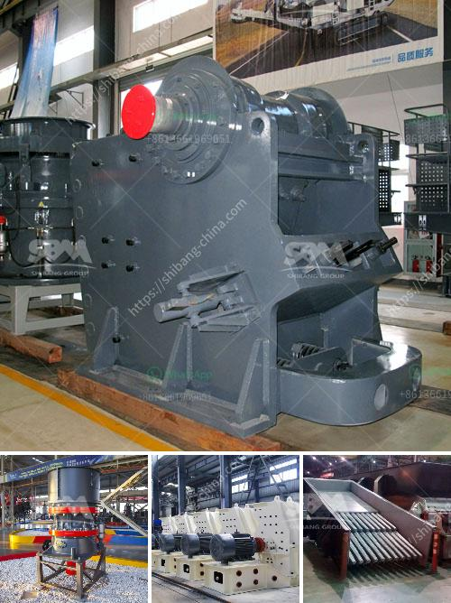

<h3>quartz powder machine</h3>
Quartz is a mineral that can be found in many different geological formations. It is abundantly found on Earth's crust and is a basic component of many types of rocks. However, quartz can also be processed into a fine powder using a quartz powder machine.

A quartz powder machine is a device used to crush minerals into fine powders. It is essential in many industries, including construction, mining, chemical, and metallurgical processes. The machine uses mechanical force to crush the quartz minerals and grind them into a powder form.

One of the primary uses of quartz powder is in the manufacturing of glass. Quartz powder adds durability and strength to the glass, making it resistant to breakage. It also enhances the optical clarity of the glass, making it suitable for making high-quality lenses, windows, and mirrors. The quartz powder machine plays a crucial role in this process by grinding quartz minerals into a fine powder that is used in glass manufacturing.

In addition to glass, quartz powder is widely used in ceramics and porcelain production. These industries utilize the properties of quartz, such as its high resistance to heat, chemical inertness, and low thermal expansion. By using a quartz powder machine, manufacturers can finely grind the quartz minerals necessary for producing high-quality ceramics and porcelain products.

Another essential application of quartz powder is in the production of paints, coatings, and industrial sealants. Quartz powder is added to these materials as a filler or extender, as it improves their durability and resistance to abrasion. The powder is also used to enhance the texture and appearance of these products. A quartz powder machine is employed to grind the quartz minerals to the desired fineness, ensuring the consistent quality of the final products.

Furthermore, quartz powder is used in the construction industry as an additive to cement and concrete. It improves the strength and durability of these materials, making them suitable for various construction applications. The powder is also used as a component in the manufacturing of bricks, tiles, and other building materials. The quartz powder machine is crucial in processing the quartz minerals needed for construction purposes.

In conclusion, a quartz powder machine plays a vital role in various industries. It is used to crush and grind quartz minerals into a fine powder, which is then utilized in different manufacturing processes. Whether it is for glass production, ceramics, paints, or construction materials, the consistent and reliable performance of a quartz powder machine is essential. The machine ensures that the quartz minerals are processed efficiently, resulting in high-quality powders that meet the specific requirements of each industry.
<h3>Contact us</h3><ul><li><strong>Whatsapp:&nbsp;<a href="https://wa.me/8613661969651">+8613661969651</a></strong></li><li><a href="https://swt.shibang-china.com/?git&amp;zhl&amp;quartz powder machine"><strong>Online Service(chat now)</strong></a></li></ul><h3>Related</h3><ul><li><a href='trapezium grinding mill.md'>trapezium grinding mill</a></li><li><a href='used cone crusher for sale ton per hour.md'>used cone crusher for sale ton per hour</a></li><li><a href='dolomite grinding machines suppliers in india.md'>dolomite grinding machines suppliers in india</a></li><li><a href='gold wash plant for sale in brazil.md'>gold wash plant for sale in brazil</a></li><li><a href='stone crushing machine suppliers.md'>stone +crushing +machine +suppliers</a></li></ul>