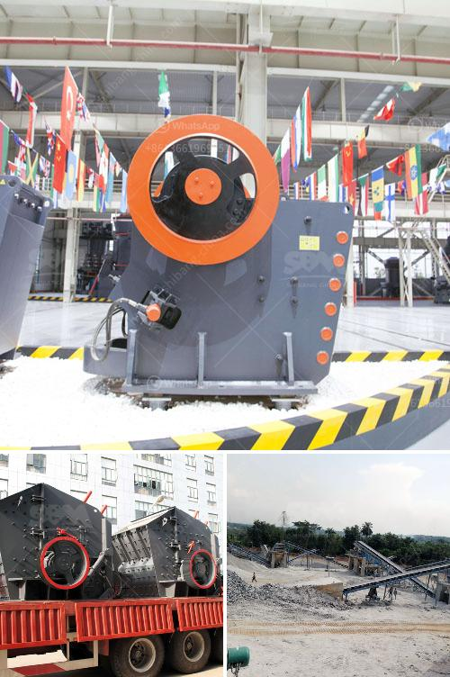

<h3>quartz rock processing equipment</h3>
Quartz rock is a versatile and widely-used mineral that is found in abundance throughout the world. It is known for its aesthetics and physical properties, making it a popular material in various industries. The processing of quartz rock requires specialized equipment to enhance its quality and extract its maximum value.

One of the primary processes in quartz rock processing is crushing. This is done to reduce the size of quartz rocks to a more manageable form, allowing for easier handling and transportation. Crushing equipment, such as jaw crushers, cone crushers, and impact crushers, are commonly used in this process. These machines break down the quartz rock into smaller, more uniform pieces, ensuring consistent quality.

After the initial crushing stage, quartz rock undergoes further processing to remove impurities and enhance its purity. This involves techniques such as scrubbing, magnetic separation, and flotation. Scrubbing is used to remove surface contaminants, while magnetic separation and flotation are utilized to remove unwanted minerals and chemicals from the quartz rock.

Once the quartz rock has been processed and purified, it can be used in various applications. The high purity and unique properties of quartz rock make it suitable for use in the production of glass, ceramics, electronic components, and solar panels. Additionally, it is used as a filler in paints, plastics, and rubber, providing reinforcement and improving their performance.

To effectively process quartz rock, specialized equipment is required. This typically includes crushers, scrubbers, magnetic separators, flotation machines, and other machinery designed specifically for quartz rock processing. These machines are equipped with advanced features and technologies to ensure efficient and precise processing, resulting in high-quality quartz products.

In conclusion, quartz rock processing equipment plays a crucial role in extracting the maximum value from quartz rocks. The process involves various stages, including crushing, purification, and refining, which are performed using specialized equipment. The final products find applications in a wide range of industries, making quartz rock an indispensable mineral in today's modern world.
<h3>Contact us</h3><ul><li><strong>Whatsapp:&nbsp;<a href="https://wa.me/8613661969651">+8613661969651</a></strong></li><li><a href="https://swt.shibang-china.com/?git&amp;zhl&amp;quartz rock processing equipment"><strong>Online Service(chat now)</strong></a></li></ul><h3>Related</h3><ul><li><a href='feldspar raymond mill grinding mill in low price.md'>feldspar raymond mill grinding mill in low price</a></li><li><a href='iron mining machine manufacturer.md'>iron mining machine manufacturer</a></li><li><a href='iron ore processing equipment.md'>iron ore processing equipment</a></li><li><a href='clinker grinding machine.md'>clinker grinding machine</a></li><li><a href='stone crusher 200 ton per.md'>stone crusher 200 ton per</a></li></ul>