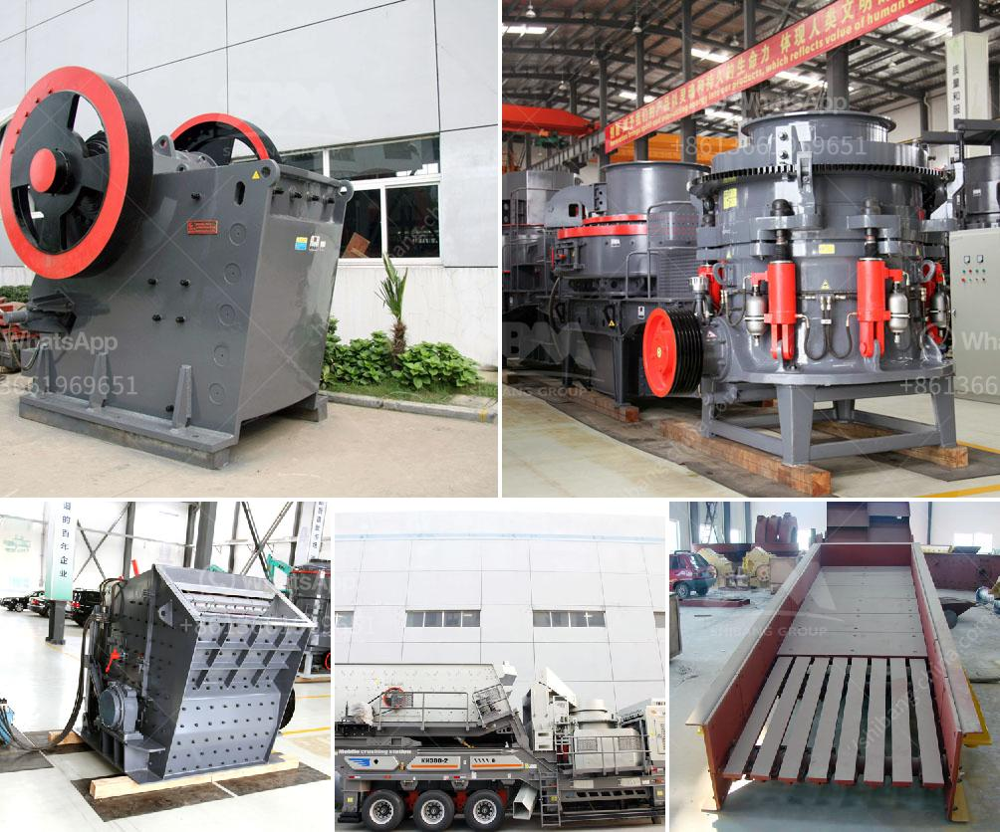

<h3>quartz stone machine price</h3>
Quartz is one of the most durable and elegant materials used in countertops, flooring, and other architectural applications. With its stunning appearance and exceptional strength, it has become a popular choice among homeowners and designers alike. However, the process of transforming raw quartz slabs into beautifully finished products requires the use of quartz stone machines, which come at various price points.

The price of quartz stone machines can vary depending on several factors, including the quality, specifications, and functionality of the equipment. Additionally, market demand and competition also play a crucial role in determining the pricing structure of these machines. Generally, the price range for quartz stone machines falls between $50,000 and $150,000.

Some of the factors that contribute to the price of quartz stone machines include the number of units produced per cycle, cutting and shaping capabilities, precision, and automation options. Machines that offer higher production capacity and advanced automation tend to be more expensive compared to those with basic functionalities. Similarly, machines with superior precision and accuracy in cutting and shaping quartz slabs also command a premium price.

Quartz stone machines are available in various types, such as bridge saws, CNC machines, polishing machines, and edge profiling machines. Each type serves a specific purpose in the production process and comes with different price tags. CNC machines, for instance, are highly versatile and can be programmed to perform various functions like cutting, shaping, and drilling. As a result, they are typically more expensive than other types of quartz stone machines.

In addition to the machine itself, other costs need to be considered when purchasing quartz stone machines. These costs may include transportation, installation, training, and after-sales services. It's important to factor in these additional expenses to get an accurate understanding of the total cost of investing in quartz stone machines.

When comparing prices of quartz stone machines, it is crucial to evaluate the overall value and long-term benefits rather than solely focusing on the initial price. Higher-priced machines may offer advanced features, better efficiency, and increased productivity, which can result in cost savings and improved profitability in the long run. Additionally, investing in a reputable brand can also ensure the quality, reliability, and durability of the machine.

To determine the ideal quartz stone machine price, it is advisable to consult with industry experts, suppliers, and manufacturers. They can provide valuable insights into the different options available and recommend the most suitable machine for specific requirements and budget constraints.

In conclusion, the price of quartz stone machines can vary depending on various factors like the machine's functionality, specifications, and quality. Considering the long-term benefits and value offered by higher-priced machines is essential when making an investment decision. Consulting with industry experts and reliable suppliers can also help in finding the right machine within a desirable price range.
<h3>Contact us</h3><ul><li><strong>Whatsapp:&nbsp;<a href="https://wa.me/8613661969651">+8613661969651</a></strong></li><li><a href="https://swt.shibang-china.com/?git&amp;zhl&amp;quartz stone machine price"><strong>Online Service(chat now)</strong></a></li></ul><h3>Related</h3><ul><li><a href='manufacture of a cone crusher.md'>manufacture of a cone crusher</a></li><li><a href='gold milling plant cost.md'>gold milling plant cost</a></li><li><a href='mill gypsum for sale in india.md'>mill gypsum for sale in india</a></li><li><a href='cement clinker grinding manufacturer.md'>cement clinker grinding manufacturer</a></li><li><a href='hammer mill nigeria.md'>hammer mill nigeria</a></li></ul>