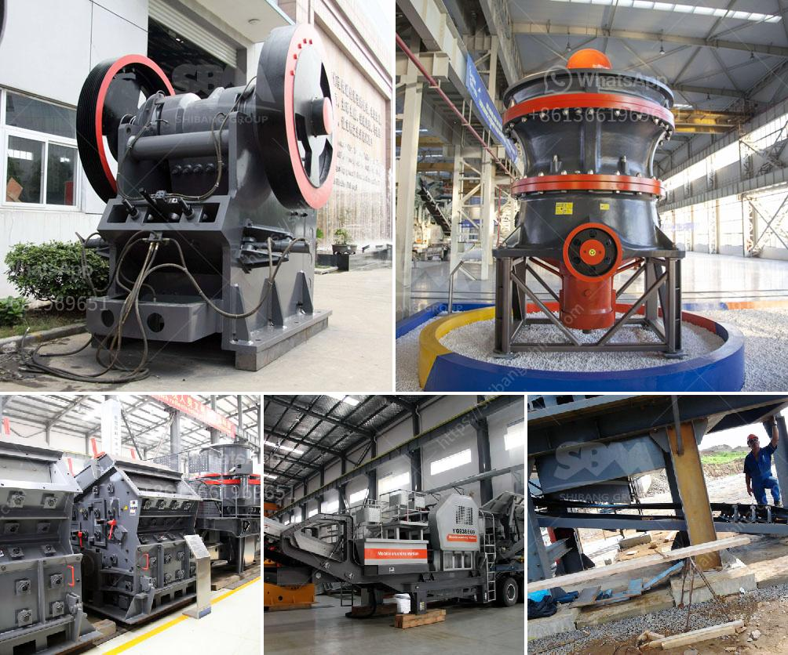

<h3>quartz stone powder mill</h3>
Quartz stone is a versatile material used for various purposes in industries such as construction, ceramics, glass manufacturing, and foundries. It is a durable and attractive material that has gained popularity over the years. However, before quartz stone can be used in these industries, it needs to undergo a grinding process to convert it into a fine powder. This is where the quartz stone powder mill comes into the picture.

The quartz stone powder mill is a powerful machine that achieves pulverization and grinding with minimum effort. The innovative design enables effortless operations, resulting in high production capacity, reduced energy consumption, and low maintenance costs. This mill breaks down the quartz stone into a fine powder suitable for various applications.

One of the key features of the quartz stone powder mill is its advanced grinding technology. It employs a combination of mechanical forces, such as compression, impact, and friction, to pulverize the quartz stone. The grinding process ensures that the powder produced is of high quality and consistent size.

The mill features a robust construction that can withstand heavy-duty use. Its durable components and high-quality materials ensure long-lasting performance, reducing the need for frequent repairs or replacements. The mill is also designed with safety features to protect workers and prevent accidents.

In addition to its durability and safety features, the quartz stone powder mill offers a range of benefits. It provides a cost-effective solution for stone grinding, reducing operational expenses and improving overall profitability. The mill is also highly efficient, allowing for increased productivity and shorter processing times.

Furthermore, the use of the quartz stone powder mill is environmentally friendly. The grinding process produces minimal dust and noise pollution, making it a sustainable choice for industries striving for a greener future. Additionally, the mill is designed to conserve energy, minimizing power consumption without compromising on performance.

The quartz stone powder mill also offers versatility in terms of applications. The fine powder produced by the mill can be used in various industries such as construction, ceramics, and manufacturing. It is commonly used as an additive in concrete, ceramics, and paints. It can also be used in the production of glass, providing a smooth and glossy finish.

Overall, the quartz stone powder mill is a revolutionary innovation in the field of stone grinding. With its advanced technology, durability, cost-effectiveness, and versatility, it offers numerous advantages for industries seeking a reliable and efficient solution for stone processing. Whether it is for construction, ceramics, glass manufacturing, or any other industry, the quartz stone powder mill is poised to be a game-changer.
<h3>Contact us</h3><ul><li><strong>Whatsapp:&nbsp;<a href="https://wa.me/8613661969651">+8613661969651</a></strong></li><li><a href="https://swt.shibang-china.com/?git&amp;zhl&amp;quartz stone powder mill"><strong>Online Service(chat now)</strong></a></li></ul><h3>Related</h3><ul><li><a href='quarry crushing line.md'>quarry crushing line</a></li><li><a href='pebble crushing production line.md'>pebble crushing production line</a></li><li><a href='hammer mill dimension.md'>hammer mill dimension</a></li><li><a href='equipment needed for quarry crusher.md'>equipment needed for quarry crusher</a></li><li><a href='brand of ball mills.md'>brand of ball mills</a></li></ul>