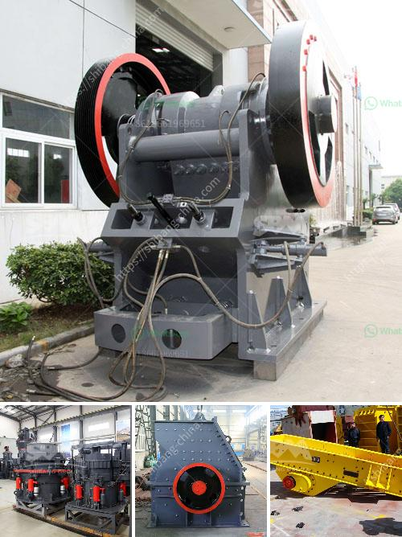

<h3>quartz stone processing machines</h3>
Quartz stone processing machines have become an essential part of the stone industry. These machines are used to cut, shape, and polish quartz slabs into various sizes and designs. With their precision and efficiency, quartz stone processing machines have revolutionized the way this exquisite material is processed.

One of the key advantages of quartz stone processing machines is their ability to cut and shape quartz slabs with extreme precision. These machines use advanced technology to ensure that every cut is accurate and consistent. This is particularly important for projects that require intricate designs or custom shapes. Whether it's a kitchen countertop or a bathroom vanity, quartz stone processing machines can create the perfect fit for any space.

In addition to precise cutting, these machines also have the ability to polish quartz slabs to a high gloss finish. This is achieved through a series of grinding and polishing pads that gradually smooth the surface of the stone. The result is a flawless, mirror-like finish that enhances the natural beauty of the quartz. This is particularly important for high-end projects that require a luxurious look and feel.

Furthermore, quartz stone processing machines are designed to maximize efficiency and reduce labor costs. With automated controls and advanced software, these machines can operate without constant supervision. This means that operators can focus on other tasks, increasing productivity and reducing overall project time.

Overall, the introduction of quartz stone processing machines has greatly improved the stone industry. These machines offer precise cutting and shaping, high-quality finishing, and increased efficiency. As a result, more and more designers and homeowners are choosing quartz for their projects. With its durability, versatility, and beauty, quartz has become a popular choice for countertops, backsplashes, and other applications. And with the help of quartz stone processing machines, the possibilities are endless.
<h3>Contact us</h3><ul><li><strong>Whatsapp:&nbsp;<a href="https://wa.me/8613661969651">+8613661969651</a></strong></li><li><a href="https://swt.shibang-china.com/?git&amp;zhl&amp;quartz stone processing machines"><strong>Online Service(chat now)</strong></a></li></ul><h3>Related</h3><ul><li><a href='stone crusher 200 ton per.md'>stone crusher 200 ton per</a></li><li><a href='stone cracker machines.md'>stone cracker machines</a></li><li><a href='mineral industrial crushers.md'>mineral industrial crushers</a></li><li><a href='industrial roller mill.md'>industrial roller mill</a></li><li><a href='rock crusher quarry.md'>rock crusher quarry</a></li></ul>