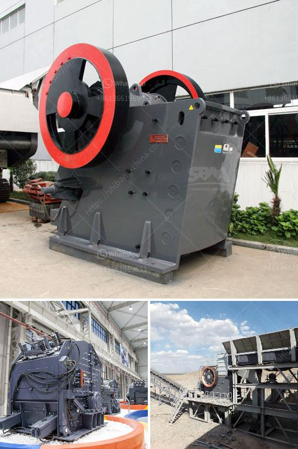

<h3>quotation ball mill</h3>
A quotation ball mill is a type of grinding mill that is used to grind materials into extremely fine powder. It is mainly used in industries such as cement, silicate products, new building materials, refractory materials, fertilizers, black and non-ferrous metal beneficiation, and glass ceramics, among others. 

The quotation ball mill operates on the principle of impact and attrition: the feed material is placed in a rotating cylinder with heavy grinding balls, which collide and grind the material into fine powder. This grinding process is highly efficient and produces a uniform product size with low energy consumption.

One of the main advantages of the quotation ball mill is its versatility. It can be used for both dry and wet grinding, and it can easily adjust the fineness of the final product. This makes it suitable for various industrial applications.

The quotation ball mill also has a compact design, which allows it to be easily installed and maintained. It requires minimal floor space and can be operated with minimal supervision. This makes it a cost-effective solution for both small and large-scale production.

Furthermore, the quotation ball mill is known for its reliability and durability. It is built with high-quality materials that can withstand the harsh conditions of industrial environments. It also has a long lifespan, ensuring consistent and reliable performance over time.

In conclusion, the quotation ball mill is a reliable and efficient grinding technology that is widely used in various industries. Its versatility, compact design, and durability make it a cost-effective solution for grinding materials into fine powder. So, if you are in need of a reliable and efficient grinding mill, consider getting a quotation ball mill for your specific application.
<h3>Contact us</h3><ul><li><strong>Whatsapp:&nbsp;<a href="https://wa.me/8613661969651">+8613661969651</a></strong></li><li><a href="https://swt.shibang-china.com/?git&amp;zhl&amp;quotation ball mill"><strong>Online Service(chat now)</strong></a></li></ul><h3>Related</h3><ul><li><a href='vibrating screen designs.md'>vibrating screen designs</a></li><li><a href='stone jaw crusher machine.md'>stone jaw crusher machine</a></li><li><a href='granite quarry crusher in nigeria.md'>granite quarry crusher in nigeria</a></li><li><a href='consumption of ball mill with roller.md'>consumption of ball mill with roller</a></li><li><a href='barite crusher machine.md'>barite crusher machine</a></li></ul>