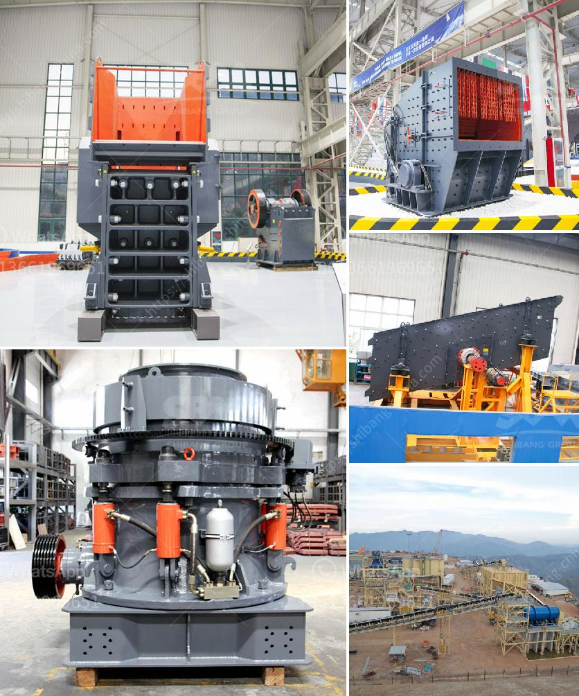

<h3>quote industrial mill quote ball mills</h3>
Industrial mills are crucial tools in various manufacturing processes, and one of the most common types is the ball mill. Often used in mining and mineral industries, these machines are responsible for crushing materials into smaller and finer particles. Their significance lies in their ability to reduce the size of raw materials, making them suitable for further processing.

The ball mill operates by rotating a cylinder with steel grinding balls, causing the balls to fall back into the cylinder and onto the material to be ground. The rotation is usually between 4 to 20 revolutions per minute, depending on the diameter of the mill. As the cylinder rotates, the grinding balls crush and grind the material into a powder-like substance.

One of the advantages of ball mills is their versatility. They can perform both dry and wet grinding processes, allowing industries to create various materials depending on their requirements. This adaptability makes them highly valuable in an array of applications, from manufacturing paints and ceramics to producing pharmaceuticals and chemicals. Additionally, the ability to operate under different conditions gives businesses the flexibility to adjust their production processes as needed.

Another essential aspect of ball mills is their efficiency. These machines are known for their high performance and energy-saving capabilities. Unlike other types of mills, such as rod or autogenous mills, ball mills utilize steel balls as grinding media, which have a higher density and are more efficient at breaking down the material. This ultimately leads to a finer and more uniform product.

In terms of maintenance, ball mills are relatively easy to manage. They require minimal monitoring and regular inspections to ensure optimal functioning. Additionally, many manufacturers provide detailed guidelines and manuals for maintenance procedures, facilitating efficient and safe operation.

Moreover, the size of industrial ball mills can vary to meet specific needs. From small laboratory-sized mills to large industrial-sized mills, these machines can accommodate various capacities. For instance, some industries need larger capacities to process larger batches, while others require smaller mills for more precise applications. The ability to customize the size of the ball mill allows businesses to achieve their desired production goals effectively.

In conclusion, ball mills are vital tools in many manufacturing processes. Their ability to crush and grind raw materials into smaller particles makes them indispensable in various industries. Offering versatility, efficiency, and customization options, ball mills help businesses streamline their operations and achieve desired outcomes.
<h3>Contact us</h3><ul><li><strong>Whatsapp:&nbsp;<a href="https://wa.me/8613661969651">+8613661969651</a></strong></li><li><a href="https://swt.shibang-china.com/?git&amp;zhl&amp;quote industrial mill quote ball mills"><strong>Online Service(chat now)</strong></a></li></ul><h3>Related</h3><ul><li><a href='sand screening machine philippines.md'>sand screening machine philippines</a></li><li><a href='cost of the project for 100 tph stone crushing unit.md'>cost of the project for 100 tph stone crushing unit</a></li><li><a href='coal vibration equipment size.md'>coal vibration equipment size</a></li><li><a href='used rock crusher dealers in usa.md'>used rock crusher dealers in usa</a></li><li><a href='grinding a stone crusher.md'>grinding a stone crusher</a></li></ul>