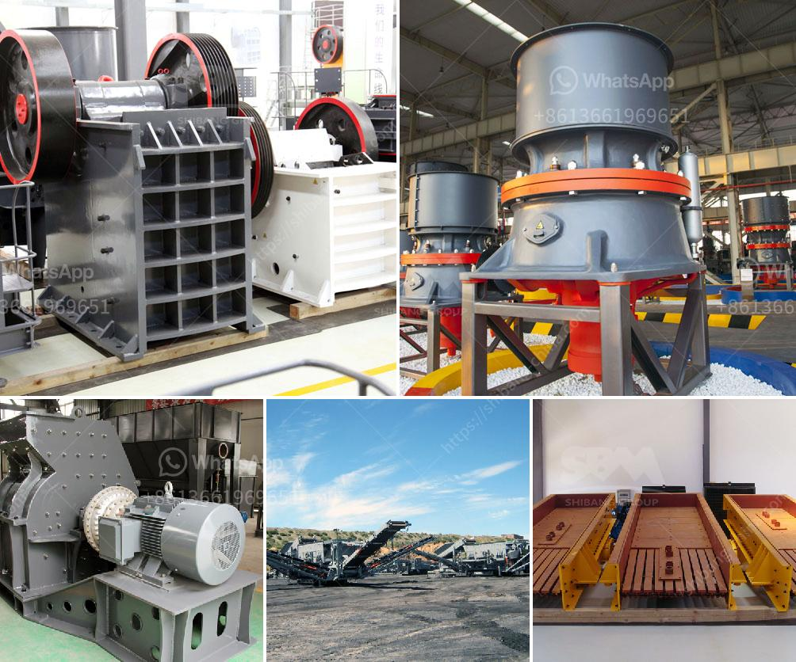

<h3>raymond grinding mill manufacturers in udaipur</h3>
Over the years, the demand for Raymond Grinding Mill has increased significantly and led to the emergence of many manufacturers in Udaipur. As one of the most popular grinding mills in the market, Raymond mill has grown in popularity among users due to its reliability, durability, and excellent performance. In Udaipur, there are several manufacturers who provide high-quality Raymond grinding mills to various industries such as mining, construction, and agriculture.

One of the leading Raymond grinding mill manufacturers in Udaipur is Vinayak Engineering Works. They are specialists in producing domestic and international standard roller mill based in Udaipur, Rajasthan. They provide in-depth expertise in manufacturing grinding mills and air swept mills. With years of experience, they are able to offer their customers custom-designed solutions for efficient and reliable grinding operations.

Another renowned manufacturer of Raymond grinding mills in Udaipur is Gupta Grinding Mills. They specialize in manufacturing and supplying heavy-duty grinding mills, including dolomite grinding mills, limestone grinding mills, and quartz grinding mills. Their products are known for their high-quality performance, durability, and efficiency.

Apart from Vinayak Engineering Works and Gupta Grinding Mills, there are several other Raymond grinding mill manufacturers in Udaipur. These manufacturers strive to provide their customers with the best possible grinding solutions that cater to their specific requirements. They use advanced manufacturing techniques and high-quality materials to produce grinding mills that are capable of handling various types of materials.

Raymond grinding mills have a wide range of applications in diverse industries. They are used for grinding various types of materials such as limestone, calcite, barite, dolomite, potassium feldspar, marble, talcum, gypsum, kaolin, bentonite, medical stone, rock phosphate, manganese ore, iron ore, quartz, active carbon, carbon black, ceramic, coal, etc. These mills are widely used in production lines for powders such as cement, silicates, refractory material, fertilizer, glass ceramics, etc.

The Raymond grinding mill manufacturers in Udaipur provide a wide range of grinding mills that can be used for grinding materials in various industries. These mills are available in different designs and sizes to cater to the diverse needs of customers. With their extensive knowledge and expertise in this field, these manufacturers are able to meet the specific requirements of their clients and provide them with high-quality grinding mills that are reliable and efficient.

In conclusion, Raymond grinding mill manufacturers in Udaipur are reliable and experienced manufacturers who specialize in providing high-quality grinding mills to various industries. With their expertise and experience, they are able to offer custom-designed solutions that meet the specific needs of their customers. If you are in need of a reliable grinding mill, consider reaching out to one of the manufacturers in Udaipur to get the best quality product.
<h3>Contact us</h3><ul><li><strong>Whatsapp:&nbsp;<a href="https://wa.me/8613661969651">+8613661969651</a></strong></li><li><a href="https://swt.shibang-china.com/?git&amp;zhl&amp;raymond grinding mill manufacturers in udaipur"><strong>Online Service(chat now)</strong></a></li></ul><h3>Related</h3><ul><li><a href='low cost gold mining equipment gold mining equipment.md'>low cost gold mining equipment gold mining equipment</a></li><li><a href='vertical grinder mill machine.md'>vertical grinder mill machine</a></li><li><a href='ball mill price in india.md'>ball mill price in india</a></li><li><a href='jaw crusher for sale uk.md'>jaw crusher for sale uk</a></li><li><a href='vibrating sieving machine.md'>vibrating sieving machine</a></li></ul>