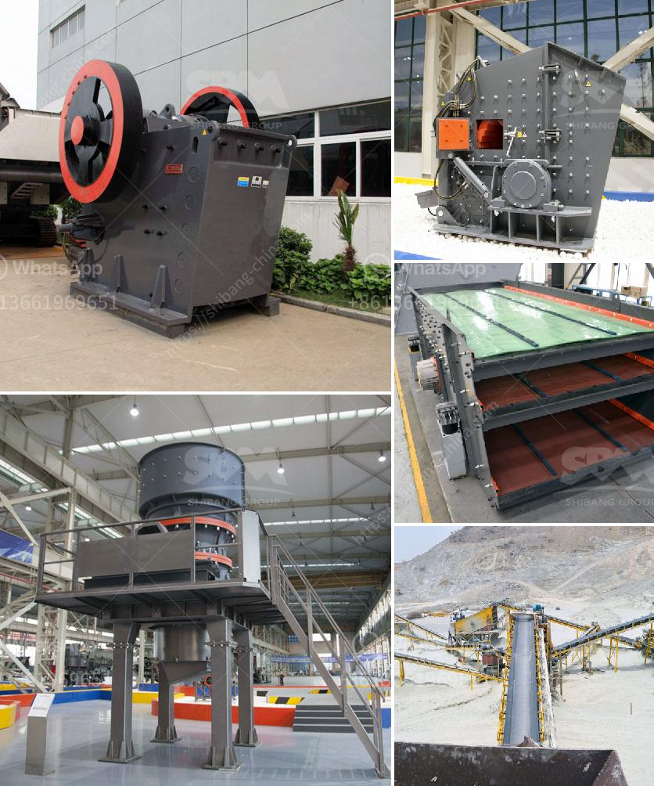

<h3>raymond grinding mill manufacturers india</h3>
Raymond grinding mill manufacturers in India have been more and more so popular in mining industry. As mining industry develops rapidly in recent years, grinding mill is necessary in mining industry. Nowadays, with the development of economy, industrial production has become an important field for national economic development. In the process of industrial production, grinding mill plays an important role. As we all know, India is a big country with abundant mineral resources, so there are many Raymond grinding mill manufacturers in India.

As we all know, grinding mill is a unit operation designed to break a solid material into smaller pieces. There are many different types of grinding mills and many types of materials processed in them. Raymond grinding mill is widely used in the grinding process metallurgy, building materials, chemicals, mining and other fields of mineral materials in grinding processing.

Raymond grinding mill is most widely used in barite, calcite, potash feldspar, talc, marble, limestone, dolomite, fluorite, lime, activated clay, activated carbon, bentonite, kaolin, cement, phosphate rock, plaster, glass, etc. Moh's hardness of which is not greater than 9.3 , and humidity below 6% of non-inflammable and non-explosive mineral, chemical, construction and other industries higher than 280 kinds of materials in the R-type Raymond machine finished products 80-325 mesh size range and arbitrary regulation, part of the material up to 600 items.

Today, the Raymond grinding mill manufacturers in India have managed to create a wide range of mills that can meet any kind of milling requirement. With a continuous effort from the manufacturer, a range of Raymond grinding mills have been made available to suit the requirements of various industries throughout the country. These grinding mills are able to grind materials such as clinker, cement, fly ash, limestone, coal and other minerals through a series of grinding processes.

The Raymond grinding mill manufacturers in India offer many benefits to customers. For instance, the product is environmentally friendly, and the Raymond grinding mill can ensure a consistent and uniform particle size distribution. Most importantly, these grinding mills are extremely cost-effective, which means that mining companies can save on their operational costs without compromising on productivity.

In conclusion, Raymond grinding mill manufacturers in India have contributed effectively to the development of mining industry. As a traditional mining equipment and widely used grinding equipment, Raymond grinding mill enjoys a high reputation in the field of grinding equipment. With the continuous efforts from the Raymond grinding mill manufacturers, the grinding mill industry in India has witnessed a flourishing development. The availability of various Raymond grinding mills has helped numerous industries meet their grinding requirements, ultimately contributing to the growth of the Indian economy.
<h3>Contact us</h3><ul><li><strong>Whatsapp:&nbsp;<a href="https://wa.me/8613661969651">+8613661969651</a></strong></li><li><a href="https://swt.shibang-china.com/?git&amp;zhl&amp;raymond grinding mill manufacturers india"><strong>Online Service(chat now)</strong></a></li></ul><h3>Related</h3><ul><li><a href='coal mining equipment for sale in germany.md'>coal mining equipment for sale in germany</a></li><li><a href='tph rock crusher.md'>tph rock crusher</a></li><li><a href='hydrated lime production processing.md'>hydrated lime production processing</a></li><li><a href='bison 120 crusher for sale.md'>bison 120 crusher for sale</a></li><li><a href='super fine roller mill.md'>super fine roller mill</a></li></ul>