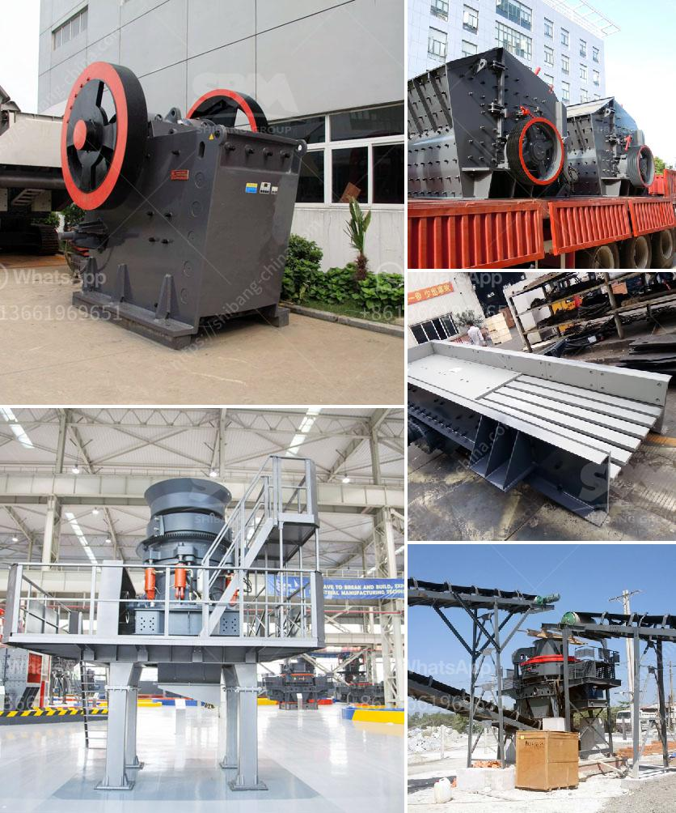

<h3>raymond mill china</h3>
Raymond mill, also known as Raymond grinding mill, is widely used in the mining, cement, and chemical industry. It is one of the essential equipment for processing non-metallic minerals such as dolomite, limestone, barite, talc, gypsum, quartzite, and bentonite. Its grinding range is wide and diverse, which has made it highly sought after in China.

Raymond mill has a long history in China. As early as the 1980s, most of the concentrators adopted the equipment imported from abroad. Due to the limitations of the foreign technology and production process, the price of Raymond mill in China was relatively high. As a result, the domestic production of Raymond mills was not competitive, and the technology and product quality lagged behind.

With the development of China's economy and the improvement of people's living standards, the demand for high-quality and advanced Raymond mills has been increasing. In order to meet the market demand, more and more Chinese enterprises have started to produce Raymond mills independently. They have invested a considerable amount of resources in research and development, improving the technology and quality of Raymond mill.

In recent years, China has made great strides in Raymond mill technology. The performance and structure of Raymond mill have been greatly improved, and its grinding fineness and production capacity have been greatly enhanced. At present, China's Raymond mill industry has formed a certain scale. Some well-known enterprises, such as SBM, Shanghai Clirik Machinery Co., Ltd., and Guilin Hongcheng Mining Equipment Manufacture Co., Ltd., have emerged and become leaders in the industry.

China's Raymond mill industry not only has a large number of enterprises but also has a strong market competitiveness. The price of Raymond mill in China is relatively low compared with that of the foreign countries. Moreover, there is a great demand for Raymond mills in China's market, which drives the rapid development of China's Raymond mill industry.

The development of Raymond mill technology in China is inseparable from the support of policies. The Chinese government has been actively encouraging the development of high-tech industries, promoting the transformation and upgrading of traditional industries, and supporting the independent innovation and research and development of Raymond mill. Various preferential policies and measures have been introduced to provide financial and technological support for enterprises and help them improve their competitiveness.

In conclusion, Raymond mill plays a significant role in China's industrial development. It is an important equipment for processing non-metallic minerals and has a wide range of applications. The continuous improvement of technology and quality has made China's Raymond mill industry gradually mature. With the support of various policies, China's Raymond mill industry will continue to develop and make greater contributions to the country's economic growth.
<h3>Contact us</h3><ul><li><strong>Whatsapp:&nbsp;<a href="https://wa.me/8613661969651">+8613661969651</a></strong></li><li><a href="https://swt.shibang-china.com/?git&amp;zhl&amp;raymond mill china"><strong>Online Service(chat now)</strong></a></li></ul><h3>Related</h3><ul><li><a href='equipment use in the mining of laterite.md'>equipment use in the mining of laterite</a></li><li><a href='manufacturing processes of clay products.md'>manufacturing processes of clay products</a></li><li><a href='famous manganese cone crusher parts made in luoyang china.md'>famous manganese cone crusher parts made in luoyang china</a></li><li><a href='project report on concrete crusher pdf.md'>project report on concrete crusher pdf</a></li><li><a href='chrome sands washing plant with prices.md'>chrome sands washing plant with prices</a></li></ul>