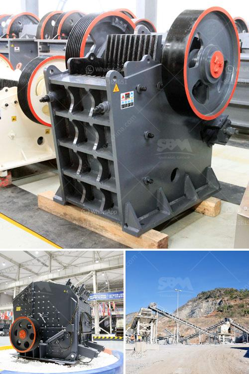

<h3>raymond mill india price</h3>
Raymond mill is a popular and advanced grinding equipment for minerals used in various industries, including mining, construction, chemical, and other manufacturing sectors. It plays an essential role in improving production efficiency, enhancing product quality, and reducing energy consumption. In recent years, the demand for Raymond mills in India has been on the rise due to the country's rapid economic development. This article explores the current Raymond mill India price and the competitive market it entails.

The Raymond mill India price is influenced by various factors, such as the manufacturer, model, technology, and production capacity. Different manufacturers offer different prices based on their brand reputation, production processes, and after-sales services. Additionally, the model and technology determine the quality and performance of the Raymond mill, thus affecting the price. Higher production capacity machines are usually priced higher compared to smaller ones.

The Indian market for Raymond mills is highly competitive, with several prominent manufacturers vying for a significant market share. Some of the well-known manufacturers in India include Birla Corporation Limited, JK Cement Ltd, Dalmia Cement (Bharat) Ltd, and Ultratech Cement Ltd, to name a few. These manufacturers produce Raymond mills that cater to various industrial needs, ensuring the availability of diverse options for customers.

The competitive market for Raymond mills in India has led to the continuous improvement and advancement of the technology used in these machines. Manufacturers have been investing in research and development to enhance the performance, energy efficiency, and durability of their Raymond mills. This has resulted in more reliable and high-quality machines, providing customers with better value for their investment.

Despite the increasing competitiveness in the market, the Raymond mill India price has remained relatively stable due to the large volume of manufacturers in the country. The competition among manufacturers helps to keep the prices reasonable, allowing customers to reap the benefits of affordable yet efficient grinding equipment. Moreover, the availability of numerous options enables buyers to compare prices and select the most suitable machine for their requirements.

In recent years, the demand for Raymond mills in India has witnessed a significant surge, primarily driven by the ongoing industrialization and infrastructure development projects across the country. The construction industry, in particular, has experienced substantial growth, leading to a greater need for quality grinding equipment. Raymond mills, with their versatility and efficiency, have become indispensable tools in various construction projects, further driving their demand.

To conclude, the Raymond mill India price is influenced by multiple factors, including the manufacturer, model, technology, and capacity. Despite the competitive market, prices have remained relatively stable, providing customers with affordable yet high-quality grinding equipment. The demand for Raymond mills in India is driven by the country's rapid economic development, especially in the construction industry. As the market continues to evolve, manufacturers are expected to further enhance their machines' capabilities, ensuring the availability of advanced and reliable Raymond mills for Indian customers.
<h3>Contact us</h3><ul><li><strong>Whatsapp:&nbsp;<a href="https://wa.me/8613661969651">+8613661969651</a></strong></li><li><a href="https://swt.shibang-china.com/?git&amp;zhl&amp;raymond mill india price"><strong>Online Service(chat now)</strong></a></li></ul><h3>Related</h3><ul><li><a href='cone crusher specifications.md'>cone crusher specifications</a></li><li><a href='used rock crushing plant for sale in uae.md'>used rock crushing plant for sale in uae</a></li><li><a href='hydraulic jaw crusher 30 x 40.md'>hydraulic jaw crusher 30 x 40</a></li><li><a href='gold conveyor belts south africa.md'>gold conveyor belts south africa</a></li><li><a href='cebu rock crusher.md'>cebu rock crusher</a></li></ul>