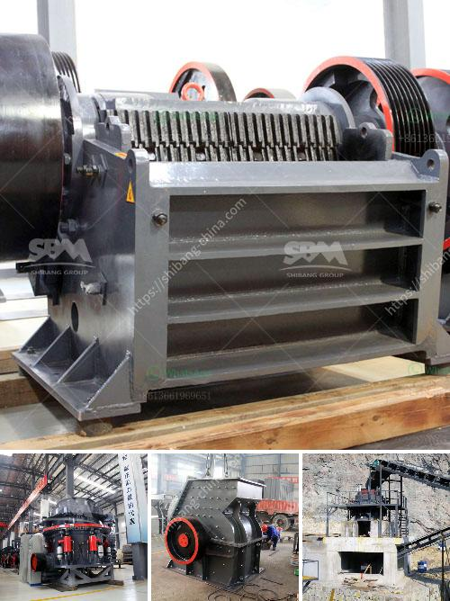

<h3>raymond mill monterrey</h3>
When it comes to grinding and processing various materials, Raymond Mill Monterrey is a name that is widely recognized in the industry. With its state-of-the-art technology and advanced machinery, this mill has brought a revolution in the grinding process.

Raymond Mill Monterrey is known for its exceptional performance when it comes to grinding materials. It is widely used in the chemical, pharmaceutical, mining, and construction industries. The mill is suitable for grinding various ores and other materials, which are widely used in industries such as metallurgy, building materials, chemicals, and mining.

One of the key features of Raymond Mill Monterrey is its ability to handle high moisture content materials, making it an ideal choice for grinding materials that contain water. This mill can effectively grind materials with a water content as high as 6%, ensuring that the final product is dry and of superior quality.

The Raymond Mill Monterrey also has a high-pressure spring system to increase grinding efficiency. It also boasts a unique design that allows for easy maintenance and operation. This mill's grinding roller assembly is of a distinctive design, which enhances the grinding efficiency and reduces wear and tear. The roller assembly is in a horizontal structure, allowing for easy replacement and maintenance.

Another significant advantage of Raymond Mill Monterrey is its high production capacity. This mill has a high output per unit, which ensures that the grinding process is efficient and productive. It can process large quantities of materials within a short period, reducing costs and increasing productivity for industries that require high-volume grinding.

The advanced technology employed in Raymond Mill Monterrey ensures that the final product has a uniform and fine particle size distribution. This mill utilizes a centrifugal force to grind materials, ensuring consistency and quality in the final product. The finely ground materials produced by this mill have a wide range of applications, including building materials, chemicals, and mining.

Furthermore, Raymond Mill Monterrey has a compact design, saving space and reducing the cost of installation. Its compact size makes it suitable for both large and small-scale grinding operations. This mill also has a low noise level, making it an ideal choice for environments where noise reduction is a priority.

In conclusion, Raymond Mill Monterrey has revolutionized the grinding process. With its advanced technology, high production capacity, and exceptional performance, this mill has become the go-to choice for industries that require efficient and high-quality grinding. Its ability to handle high moisture content materials and provide a uniform particle size distribution makes it a versatile solution for various applications. Whether it is grinding ores or materials for construction, chemical, or pharmaceutical industries, Raymond Mill Monterrey is sure to deliver exceptional results.
<h3>Contact us</h3><ul><li><strong>Whatsapp:&nbsp;<a href="https://wa.me/8613661969651">+8613661969651</a></strong></li><li><a href="https://swt.shibang-china.com/?git&amp;zhl&amp;raymond mill monterrey"><strong>Online Service(chat now)</strong></a></li></ul><h3>Related</h3><ul><li><a href='gold crusher for sale in china.md'>gold crusher for sale in china</a></li><li><a href='mobile crushing plant for limestone.md'>mobile crushing plant for limestone</a></li><li><a href='processing of kaolin crusher.md'>processing of kaolin crusher</a></li><li><a href='conveyor belt seller in philippines.md'>conveyor belt seller in philippines</a></li><li><a href='roller mill from china.md'>roller mill from china</a></li></ul>