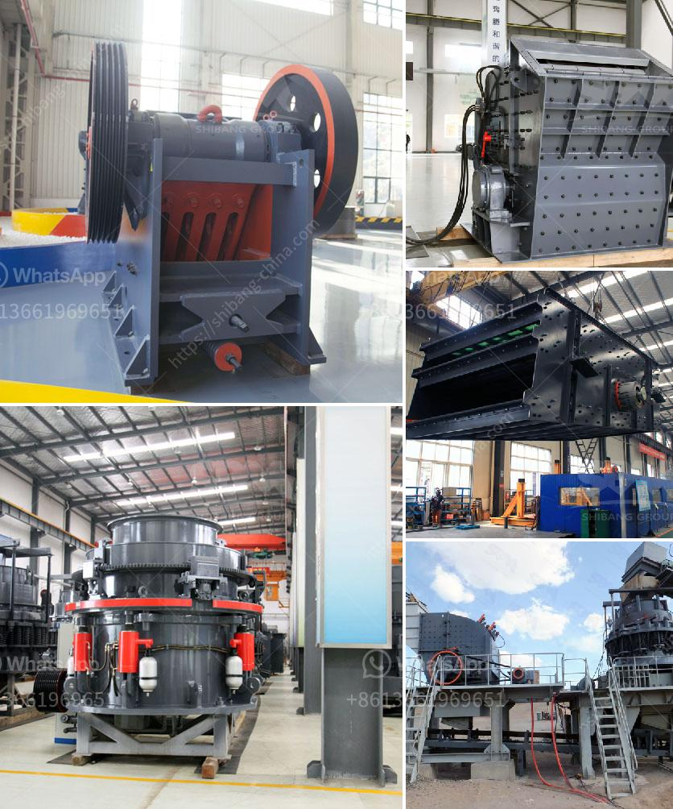

<h3>raymond mill mumbai and africa</h3>
Raymond Mill Mumbai, a leading global manufacturer of industrial machinery, has been successfully expanding its presence and operations in Africa. This strategic move not only strengthens the company's foothold in the region but also unlocks new opportunities for economic development and technological advancements. With a focus on promoting sustainable practices and enhancing manufacturing capabilities, Raymond Mill Mumbai is making a significant impact in Africa's industrial landscape.

Africa's industrial sector has witnessed substantial growth in recent years, attracting major players like Raymond Mill Mumbai. By establishing manufacturing facilities in prominent African countries, the company is contributing to the continent's economic development. These facilities not only employ local talent but also generate a demand for auxiliary industries and suppliers, promoting job creation and skill development.

Recognizing the need for localized operations, Raymond Mill Mumbai has been actively engaging with local communities in Africa. By collaborating with local partners and employing a workforce composed of African talent, the company ensures its operations align with the socio-cultural fabric of the region. This approach fosters trust, enhances stakeholder engagement, and contributes to the overall sustainability of the company's operations.

Raymond Mill Mumbai brings its extensive experience and technological expertise to Africa, facilitating the introduction of advanced machinery and processes in the region. As a result, African industries can enhance their manufacturing capabilities and meet international quality standards. Through technology transfer initiatives, technical training, and knowledge-sharing programs, Raymond Mill Mumbai is empowering African industries to become more competitive on a global scale.

As sustainability becomes an increasingly crucial aspect of industrial growth, Raymond Mill Mumbai is committed to promoting environmental responsibility in Africa. By incorporating green manufacturing practices, the company reduces its carbon footprint and minimizes the impact on the local ecosystem. Additionally, Raymond Mill Mumbai integrates resource-efficient production processes, waste management systems, and energy-saving measures into its operations, serving as a role model for sustainable industrial development in Africa.

Another significant aspect of Raymond Mill Mumbai's presence in Africa is its collaborative approach. The company partners with local businesses, governments, and industry associations to foster long-term and mutually beneficial relationships. By sharing knowledge, expertise, and resources, both parties can leverage each other's strengths, collectively boosting economic growth and industry development.

Raymond Mill Mumbai's expansion into Africa represents a transformative step for the continent's industrial landscape. Through its localized operations, technological advancements, and commitment to sustainability, the company is actively contributing to economic growth, employment generation, and skill development in Africa. As Raymond Mill Mumbai strengthens its presence in the region, this partnership serves as a catalyst for Africa's industrial transformation and fosters a roadmap for sustained and inclusive development.
<h3>Contact us</h3><ul><li><strong>Whatsapp:&nbsp;<a href="https://wa.me/8613661969651">+8613661969651</a></strong></li><li><a href="https://swt.shibang-china.com/?git&amp;zhl&amp;raymond mill mumbai and africa"><strong>Online Service(chat now)</strong></a></li></ul><h3>Related</h3><ul><li><a href='ball mill ball portable.md'>ball mill ball portable</a></li><li><a href='vertical grinding process.md'>vertical grinding process</a></li><li><a href='bauxite processing plant.md'>bauxite processing plant</a></li><li><a href='coal mill in power plant.md'>coal mill in power plant</a></li><li><a href='rock crusher quarry.md'>rock crusher quarry</a></li></ul>