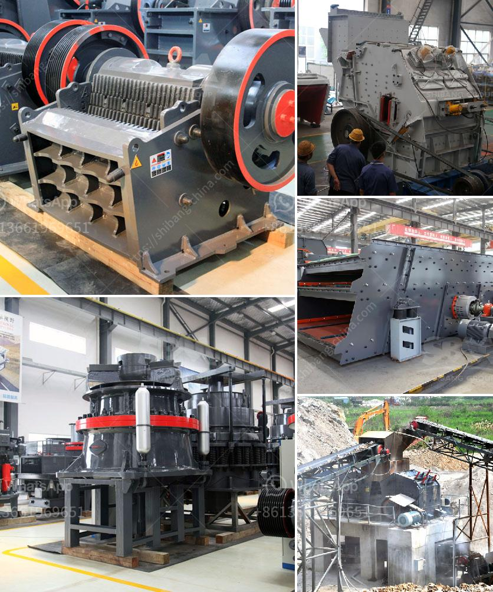

<h3>raymond mill parts</h3>
Raymond mill is a common grinding equipment, used to grind non-flammable and non-explosive materials such as barite, calcite, potash feldspar, talcum, marble, limestone, ceram, and slag. Raymond mill parts are the main parts of this machine that affect the working performance of Raymond mill. The Raymond mill parts include wear parts (blade, grinding roller, grinding ring, motor, shell liner, etc.) and vulnerable parts (shaft, pinion, gears, bearings, transmission device, etc.).

Wear parts are the core parts of Raymond mill, which directly affect the grinding efficiency and service life of Raymond mill. Blade, grinding roller, and grinding ring form a grinding system, that together drive the operation of the machine. The blade is responsible for turning over the materials and bringing them to the grinding ring for grinding. The grinding roller and grinding ring grind the materials through the action of centrifugal force and fall into the grinding chamber.

Vulnerable parts of Raymond mill mainly include bearings, shafts, pinions, gears, and transmission devices. These parts are crucial to the overall performance and smooth operation of the mill. Bearings ensure the rotation of the shaft and rollers, while shafts and pinions are responsible for transmitting power from the motor to the grinding ring. Gears are used to control the speed of the mill, ensuring the materials are properly ground.

To ensure the normal operation of Raymond mill, it is essential to properly maintain and replace the worn parts. Regular inspections and maintenance can help identify any potential issues and prevent them from developing into costly repairs. When replacing parts, it is important to use high-quality parts that are designed specifically for Raymond mill.

In conclusion, Raymond mill parts play a crucial role in the grinding process of the mill, affecting both its performance and service life. Wear parts such as blades, grinding rollers, and grinding rings directly impact the grinding efficiency and output of the mill. Vulnerable parts such as bearings, shafts, and gears are essential for the smooth operation of the mill. Regular maintenance and replacement of these parts are necessary to ensure the mill's longevity and optimal performance.
<h3>Contact us</h3><ul><li><strong>Whatsapp:&nbsp;<a href="https://wa.me/8613661969651">+8613661969651</a></strong></li><li><a href="https://swt.shibang-china.com/?git&amp;zhl&amp;raymond mill parts"><strong>Online Service(chat now)</strong></a></li></ul><h3>Related</h3><ul><li><a href='rock quarrying in cameroon.md'>rock quarrying in cameroon</a></li><li><a href='conveyor belts for buckets.md'>conveyor belts for buckets</a></li><li><a href='powder making machines.md'>powder making machines</a></li><li><a href='18tph roll mill process.md'>18tph roll mill process</a></li><li><a href='price of ballast crusher per ton in kenya.md'>price of ballast crusher per ton in kenya</a></li></ul>