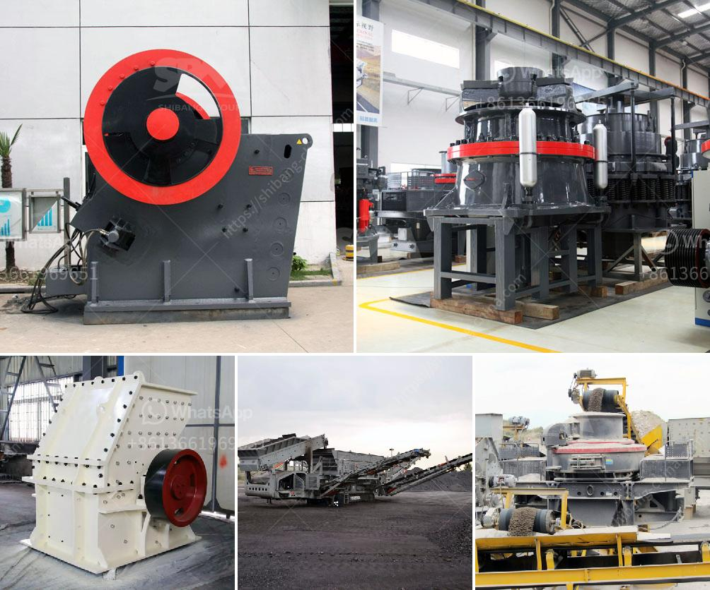

<h3>raymond mill price list</h3>
When it comes to purchasing equipment, price is always a significant factor we consider. Raymond mill is a commonly used grinding equipment, mainly used for barite, calcite, feldspar, talc, marble, limestone, dolomite, fluorite, lime, activated clay, activated carbon, bentonite, kaolin, cement, phosphate ore, gypsum, glass, insulation materials, etc. With the wide application range, raymond mill has become an indispensable grinding equipment in the mining industry.

The price of raymond mill varies with its specifications and models. Different manufacturers offer different prices. Generally speaking, the price of raymond mill ranges from tens of thousands to hundreds of thousands. These price differences arise from various factors, such as the model, manufacturer, technology support, and after-sales service.

Firstly, the model and size of raymond mill will affect its price. Different models have different capacity, input size, and output size. Therefore, customers need to choose the appropriate model according to their actual needs.

Secondly, the manufacturer is another crucial factor affecting the price. The well-known manufacturers often have more advanced technology, higher product quality, and better after-sales service. Devoting to providing customers with high-quality machines, they usually charge higher prices compared to less-known manufacturers.

Lastly, the technology support and after-sales service provided by the manufacturer will also affect the price. Good after-sales service can guarantee the stable operation of the equipment and prolong its service life. Therefore, the cost of technology support and after-sales service is included in the price of raymond mill.

To find a suitable raymond mill with an affordable price, customers need to compare various manufacturers and models. They can search for raymond mill price list online, and make a comparison based on their actual needs. It is also recommended to communicate with manufacturers directly to get a more accurate quotation.

In conclusion, the price of raymond mill is influenced by various factors, such as model, manufacturer, technology support, and after-sales service. Therefore, customers should carefully consider their actual needs and choose a suitable machine with an affordable price. By doing so, they can ensure a smooth operation and cost-effective investment.
<h3>Contact us</h3><ul><li><strong>Whatsapp:&nbsp;<a href="https://wa.me/8613661969651">+8613661969651</a></strong></li><li><a href="https://swt.shibang-china.com/?git&amp;zhl&amp;raymond mill price list"><strong>Online Service(chat now)</strong></a></li></ul><h3>Related</h3><ul><li><a href='sand washing machines turkey.md'>sand washing machines turkey</a></li><li><a href='crushing machine price in malaysia.md'>crushing machine price in malaysia</a></li><li><a href='calcium carbonate factory costs.md'>calcium carbonate factory costs</a></li><li><a href='bentonite pulverizer ball mill in gujrat.md'>bentonite pulverizer ball mill in gujrat</a></li><li><a href='gypsum ball mill manufacturing machine.md'>gypsum ball mill manufacturing machine</a></li></ul>