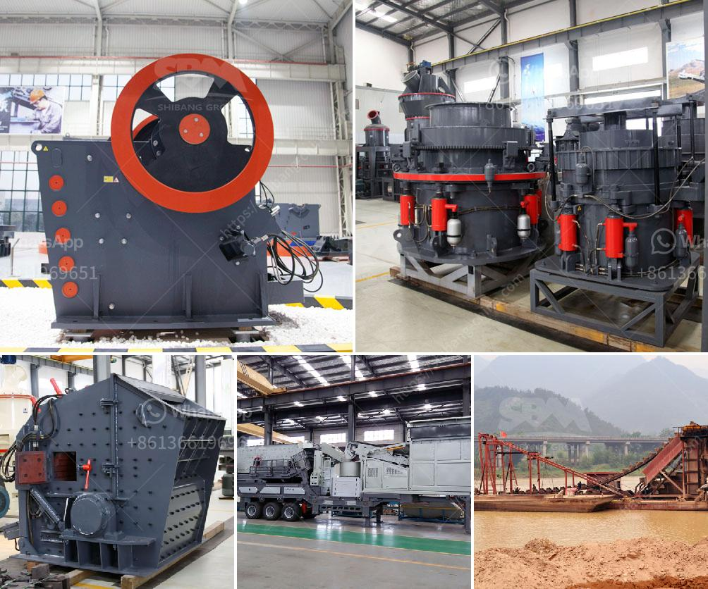

<h3>raymond vertical mill product size 3 30 micron</h3>
The Raymond® Vertical Mill is a high-speed air-swept swing hammer mill used to pulverize materials in the extreme fineness range. This mill efficiently delivers consistent micron-sized particles, keeping the desired product size within the range of 3-30 microns. With its advanced technology and superior performance, the Raymond Vertical Mill is an excellent choice for various grinding applications.

The key benefit of the Raymond Vertical Mill is its exceptional ability to produce finely ground particles in a cost-effective manner. The mill's grinding chamber consists of numerous closely spaced steel balls or rollers, which generate intense impact and friction to pulverize the material. This unique design ensures efficient grinding, resulting in a uniform product size distribution.

One of the major advantages of the Raymond Vertical Mill is its high grinding efficiency. The mill operates at a very high tip speed (up to 19,500 feet per minute), which allows for fast and efficient grinding of even the hardest materials. Moreover, the mill's airflow system ensures that the material remains within the grinding chamber for the desired amount of time, maximizing the grinding efficiency.

The Raymond Vertical Mill is also known for its reliable and consistent performance. The mill's advanced control system enables precise control of the grinding process, ensuring that the desired particle size is achieved consistently. The mill's rugged construction and robust components further contribute to its reliability, providing years of trouble-free operation.

The ability to produce particles within the range of 3-30 microns makes the Raymond Vertical Mill suitable for a wide range of industries and applications. This mill is particularly useful in industries such as chemicals, minerals, and pigments, where achieving precise particle size distribution is crucial. The ability to grind materials to such fine sizes allows for enhanced product quality, improved product stability, and increased efficiency in downstream processes.

In addition to its grinding capabilities, the Raymond Vertical Mill offers versatility in terms of material handling. The mill can handle a wide variety of materials, including minerals, ores, chemicals, and various industrial products. The adjustable air classifier within the mill allows for precise control of the product's fineness, further enhancing its versatility.

Overall, the Raymond Vertical Mill is a reliable and efficient grinding solution for various industries. Its ability to produce finely ground particles within the range of 3-30 microns sets it apart from other grinding mills. With its high grinding efficiency, reliable performance, and versatility, the Raymond Vertical Mill is an excellent investment for any company looking to achieve finely ground particles for their products.
<h3>Contact us</h3><ul><li><strong>Whatsapp:&nbsp;<a href="https://wa.me/8613661969651">+8613661969651</a></strong></li><li><a href="https://swt.shibang-china.com/?git&amp;zhl&amp;raymond vertical mill product size 3 30 micron"><strong>Online Service(chat now)</strong></a></li></ul><h3>Related</h3><ul><li><a href='stone crusher prices german.md'>stone crusher prices german</a></li><li><a href='primary crusher ball milling pengertian.md'>primary crusher ball milling pengertian</a></li><li><a href='price of ballast crusher per ton in kenya.md'>price of ballast crusher per ton in kenya</a></li><li><a href='gold crusher for sale in china.md'>gold crusher for sale in china</a></li><li><a href='concrete crusher plant uae.md'>concrete crusher plant uae</a></li></ul>