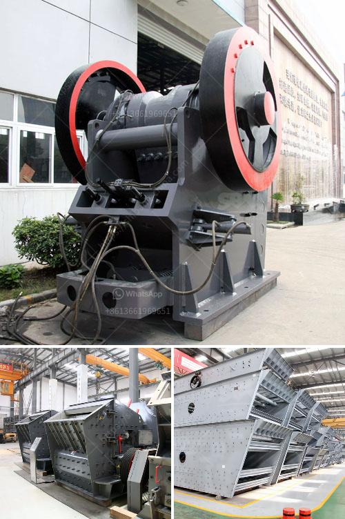

<h3>recycled concrete crusher</h3>
In today's increasingly eco-conscious world, construction projects that incorporate sustainable practices have become more crucial than ever. Recycling and reusing construction materials, such as concrete, is an effective way to reduce waste and minimize the environmental impact of building projects. The advent of recycled concrete crushers has made this process even easier and more efficient.

A recycled concrete crusher is a machine that processes old, unused concrete, providing an environmentally-friendly solution for many construction projects. Recycled concrete aggregate (RCA) is produced by crushing concrete into reusable materials, making it a cost-effective option for many projects. This process also diverts concrete waste from landfills, reducing the need for new raw materials and preserving natural resources.

One of the primary advantages of using a recycled concrete crusher is that it can significantly reduce construction costs. RCA is not only more affordable than using new materials but also requires fewer resources for extraction and transportation. Additionally, crusher machines are often portable and can be easily moved to different job sites, eliminating the need for transporting concrete waste to a central location.

Moreover, recycled concrete crushers play a vital role in creating a circular economy within the construction industry. By reusing old concrete, these machines prevent excessive disposal of construction waste, reducing landfill usage and associated costs. The recycled concrete can be used in various applications, such as road base, foundations, and even new construction projects, replacing the need for virgin aggregates.

Another significant advantage of using a recycled concrete crusher is its positive impact on greenhouse gas emissions. Construction and demolition waste are major contributors to global carbon emissions, releasing harmful gases, such as carbon dioxide (CO2), into the atmosphere. By recycling concrete and reducing the need for new materials production, these crushers help mitigate climate change and promote sustainable development.

Notably, the process of crushing concrete does not compromise the quality or performance of the resulting recycled materials. In fact, RCA can often exhibit similar or even better properties than traditional aggregates. The crushed concrete undergoes rigorous testing to ensure that it meets industry standards for strength, durability, and other essential attributes.

While there are numerous benefits associated with recycled concrete crushers, it is important to acknowledge some considerations. The quality and type of concrete being recycled can impact the final RCA product. Clean concrete with minimal contaminants, such as reinforcement bars or other debris, is ideal for recycling. Additionally, the crusher machine's design and capacity should match the volume and type of concrete being processed to ensure optimal efficiency.

In conclusion, the use of recycled concrete crushers offers an efficient and sustainable solution for the construction industry. These machines support the principles of a circular economy by diverting concrete waste from landfills, reducing carbon emissions, and conserving natural resources. By choosing to incorporate recycled concrete into their projects, builders and contractors can contribute to a greener future while saving costs and maintaining the quality of their constructions.
<h3>Contact us</h3><ul><li><strong>Whatsapp:&nbsp;<a href="https://wa.me/8613661969651">+8613661969651</a></strong></li><li><a href="https://swt.shibang-china.com/?git&amp;zhl&amp;recycled concrete crusher"><strong>Online Service(chat now)</strong></a></li></ul><h3>Related</h3><ul><li><a href='jaw crusher price in kenya.md'>jaw crusher price in kenya</a></li><li><a href='ball mill machinery manufacturer india.md'>ball mill machinery manufacturer india</a></li><li><a href='malaysia companies that manufacture crushing machines.md'>malaysia companies that manufacture crushing machines</a></li><li><a href='sand washing machines turkey.md'>sand washing machines turkey</a></li><li><a href='second hand equipment for sale in south africa.md'>second hand equipment for sale in south africa</a></li></ul>