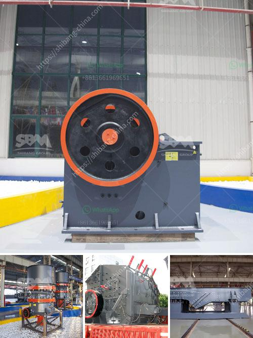

<h3>recycled glass countertops south africa</h3>
In recent years, there has been a growing global concern about the impact of human activities on the environment. This concern has led to a push for more sustainable alternatives in various sectors, including interior design and home improvement. One such alternative gaining popularity in South Africa is recycled glass countertops.

Recycled glass countertops are an innovative and sustainable product that offers numerous benefits to homeowners. These countertops are made from a combination of recycled glass and a binder material such as concrete or resin. The glass used in the manufacturing process is sourced from various post-consumer and industrial waste streams, making it an environmentally friendly choice.

One significant advantage of recycled glass countertops is their unique aesthetic appeal. The use of recycled glass allows for a wide range of colors, patterns, and textures to be incorporated into the countertops, making them a versatile choice for any home decor style. Whether you prefer a sleek and modern look or a more rustic and eclectic feel, there is a recycled glass countertop design to suit your taste.

Beyond their visual appeal, recycled glass countertops also offer practical benefits. They are highly durable and resistant to stains, scratches, and heat, making them suitable for use in kitchens and bathrooms. This durability ensures that your countertops will maintain their beauty and functionality for years to come, reducing the need for frequent replacements.

Furthermore, recycled glass countertops are a low-maintenance option. Their non-porous surface prevents the growth of bacteria and mold, making them easy to clean with just soap and water. This not only saves you time and effort in the upkeep of your countertops but also promotes a healthier living environment for you and your family.

From an environmental perspective, choosing recycled glass countertops is a responsible decision. By utilizing waste glass as a resource, these countertops help reduce the demand for new raw materials and the associated energy consumption and carbon emissions. Additionally, the manufacturing process for recycled glass countertops consumes less water and generates fewer pollutants compared to traditional countertop materials.

In South Africa, where the conservation of natural resources is of increasing importance, the adoption of recycled glass countertops can have a significant positive impact. The country generates a substantial amount of glass waste, and proper recycling methods are crucial for its management. By supporting the local recycling industry through the use of recycled glass countertops, South African homeowners contribute to a circular economy and promote sustainable practices.

In conclusion, recycled glass countertops offer a sustainable and attractive option for South African homes. Their unique aesthetic appeal, durability, low maintenance, and environmental benefits make them a popular choice among homeowners seeking to create beautiful and sustainable living spaces. By opting for recycled glass countertops, South Africans can play their part in promoting a greener future and contribute to a more sustainable way of life.
<h3>Contact us</h3><ul><li><strong>Whatsapp:&nbsp;<a href="https://wa.me/8613661969651">+8613661969651</a></strong></li><li><a href="https://swt.shibang-china.com/?git&amp;zhl&amp;recycled glass countertops south africa"><strong>Online Service(chat now)</strong></a></li></ul><h3>Related</h3><ul><li><a href='prices of vibrating screens.md'>prices of vibrating screens</a></li><li><a href='crusher near sale saudi arabia.md'>crusher near sale saudi arabia</a></li><li><a href='pebble crushing equipment.md'>pebble crushing equipment</a></li><li><a href='limestone jaw crusher sizes.md'>limestone jaw crusher sizes</a></li><li><a href='low cost gold mining equipment gold mining equipment.md'>low cost gold mining equipment gold mining equipment</a></li></ul>