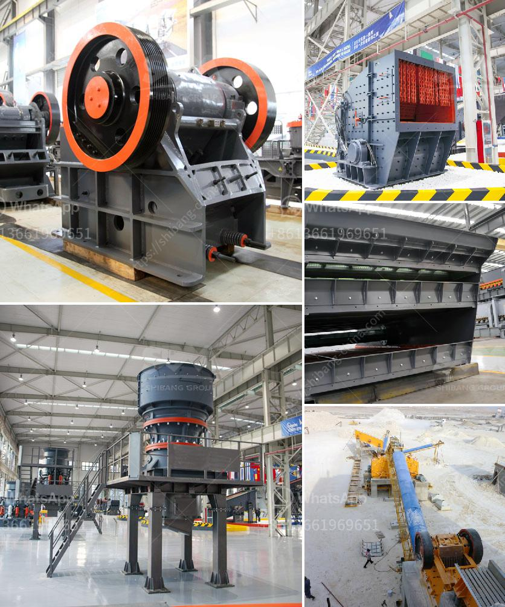

<h3>recycling machines stone production</h3>
Stone, a naturally occurring material, has been used in construction and various industries for centuries. However, the extraction and processing of stone can have detrimental effects on the environment. To promote sustainable practices, recycling machines have been introduced in stone production. These machines play a crucial role in reducing waste, energy consumption, and carbon emissions associated with the production process.

One key aspect of stone production that recycling machines address is the waste generated during the cutting and shaping of stone. Traditionally, large amounts of stone residues would end up in landfills, contributing to environmental pollution. Recycling machines efficiently collect these residues and transform them into usable materials. By recycling these wastes, the industry decreases its reliance on virgin stone, which results in reduced quarrying activities and minimizes the associated environmental impacts.

Furthermore, recycling machines aid in conserving energy and reducing carbon emissions. The use of these machines allows stone producers to utilize recycled stone products instead of relying solely on newly quarried stone. The former requires significantly less energy compared to the extraction and processing of raw materials. By using recycled stone, carbon emissions associated with transportation and manufacturing processes are also reduced. Additionally, recycling machines are designed to be energy-efficient, further contributing to the overall sustainability of the stone production process.

Not only do recycling machines provide environmental benefits, but they also contribute to the economic growth of the stone industry. The reuse of stone residues reduces the need for costly waste disposal methods, such as landfilling. Additionally, recycling machines can enhance the overall quality of stone products. By repurposing previously discarded stone materials, stone manufacturers can create unique designs and patterns, thus attracting a broader customer base. This can result in increased sales and profitability for businesses involved in the stone production sector.

While the implementation of recycling machines in stone production brings forth numerous advantages, it is essential to address potential challenges. One such challenge is the initial investment required to acquire recycling machines. Stone producers may hesitate to invest in these machines due to the upfront costs. However, by considering the long-term benefits, including cost savings and reduced environmental impact, these investments can prove to be financially prudent.

Moreover, educating and raising awareness among stone industry stakeholders about the benefits of recycling machines is crucial. By highlighting the positive environmental and economic outcomes associated with their use, more stone producers may be encouraged to adopt these sustainable practices. Governments and industry associations can play a vital role in providing incentives and support to facilitate the wider adoption of recycling machines in stone production.

In conclusion, recycling machines in stone production are a significant step towards promoting sustainability. By reducing waste, conserving energy, and lowering carbon emissions, these machines contribute to a more environmentally friendly stone industry. Additionally, the economic benefits, including cost savings and enhanced product quality, further incentivize the adoption of recycling machines. As the global focus on sustainable practices intensifies, the stone industry must embrace and invest in recycling machines to meet these demands and secure a greener future.
<h3>Contact us</h3><ul><li><strong>Whatsapp:&nbsp;<a href="https://wa.me/8613661969651">+8613661969651</a></strong></li><li><a href="https://swt.shibang-china.com/?git&amp;zhl&amp;recycling machines stone production"><strong>Online Service(chat now)</strong></a></li></ul><h3>Related</h3><ul><li><a href='jaw crusher in uae.md'>jaw crusher in uae</a></li><li><a href='used crushers prices in nigeria.md'>used crushers prices in nigeria</a></li><li><a href='slag crushing plant.md'>slag crushing plant</a></li><li><a href='slag crusher machine india.md'>slag crusher machine india</a></li><li><a href='industrial roller mill.md'>industrial roller mill</a></li></ul>