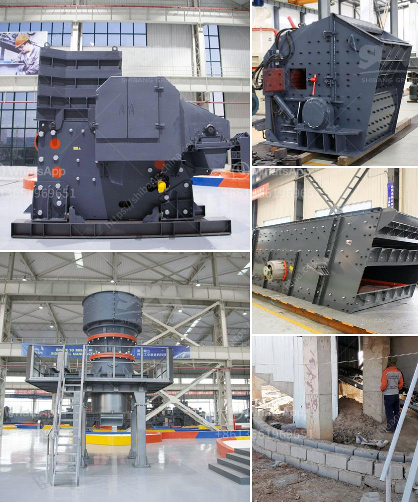

<h3>river sand and stone mining at sabah</h3>
River sand and stone mining at Sabah have become major concerns due to their detrimental impact on the environment and communities surrounding the region. This article aims to shed light on these issues and emphasize the urgent need for sustainable approaches to mining activities.

Sabah, situated on the northern part of Borneo Island, is known for its rich and diverse natural resources, including rivers and stone deposits. River sand and stones are essential materials used in construction, infrastructure development, and other industries. However, the unregulated and excessive extraction of these resources has resulted in severe ecological damage, water pollution, and social conflicts.

One of the major ecological concerns related to river sand mining is the destruction of riverbeds and their ecosystems. Rivers play a crucial role in supporting biodiverse habitats and maintaining the balance of the ecosystem. The excavation of riverbeds disrupts the natural flow of water, alters sediment patterns, and destroys the homes of various aquatic species. This disruption can lead to the decline in fish populations, affecting not only the local ecosystem but also the livelihoods of fishing communities.

Furthermore, indiscriminate sand and stone mining practices often involve the use of heavy machinery, which leaves a significant footprint on the landscape. The excessive noise and vibrations caused by these mining activities can disturb wildlife, disrupt breeding patterns, and even cause physical damage to nearby structures. The machinery used in mining also emits pollutants, such as dust and exhaust fumes, which further degrade air quality and pose health risks to nearby communities.

In addition to ecological concerns, river sand and stone mining in Sabah have also caused social conflicts and affected local communities. Mining activities often involve encroachment on indigenous lands and territories, leading to conflicts over land ownership and displacement of indigenous communities. The disruption of river ecosystems can also disrupt the traditional practices and cultural heritage of these communities, further exacerbating their marginalization.

To address these issues, there is an urgent need for sustainable approaches to river sand and stone mining in Sabah. First and foremost, stricter regulations and enforcement are essential to ensure responsible mining practices. Government authorities should impose limits on the extraction of river sand and stones, while also monitoring and auditing mining operations to ensure compliance with environmental and social standards.

Encouraging the use of alternative materials for construction, such as recycled aggregates, can also help reduce the demand for river sand and mitigate the negative impact of extraction. Investing in research and development of innovative construction technologies, including the use of alternative materials, can provide sustainable solutions for the construction industry in Sabah.

Additionally, raising awareness among the public about the importance of sustainable mining practices and the ecological value of rivers is crucial. Education and advocacy campaigns can empower communities to hold mining companies accountable and engage in dialogue with policymakers to establish sustainable mining practices.

In conclusion, the unregulated mining of river sand and stones in Sabah poses significant threats to the environment and the well-being of local communities. Sustainable mining practices, strict regulations, and public awareness are crucial in addressing these issues. By prioritizing the preservation of river ecosystems and promoting responsible mining, Sabah can ensure the long-term sustainability of its natural resources and promote a balanced and harmonious relationship between economic development and environmental conservation.
<h3>Contact us</h3><ul><li><strong>Whatsapp:&nbsp;<a href="https://wa.me/8613661969651">+8613661969651</a></strong></li><li><a href="https://swt.shibang-china.com/?git&amp;zhl&amp;river sand and stone mining at sabah"><strong>Online Service(chat now)</strong></a></li></ul><h3>Related</h3><ul><li><a href='crushing and serreing machinery.md'>crushing and serreing machinery</a></li><li><a href='cebu rock crusher.md'>cebu rock crusher</a></li><li><a href='milling equipment for talcum powder.md'>milling equipment for talcum powder</a></li><li><a href='gold processing plant dry.md'>gold processing plant dry</a></li><li><a href='how to start a stone crusher business.md'>how to start a stone crusher business</a></li></ul>