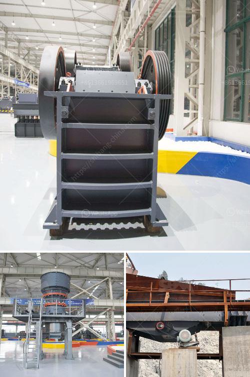

<h3>rock cone crushers</h3>
Rock cone crushers are a crucial equipment used in the construction and mining industry. It is used for breaking down large rocks into smaller pieces, making it easier for construction and mining projects to proceed. In addition, it is highly versatile and is used for secondary and tertiary crushing in various applications. In this article, we will explore the working principle and benefits of rock cone crushers.

One of the key features of a rock cone crusher is the ability to provide high reduction ratios with a minimal loss of material. This is achieved through the principle of compression crushing, where the rocks are squeezed between the mantle and concave liners. As the rocks enter the crushing chamber, they are progressively crushed until they are small enough to pass through the narrow opening at the bottom of the crusher.

The design of rock cone crushers allows for a larger feed opening compared to other crushers of the same size. This enables them to handle larger rocks and produce a more uniform product size. Additionally, the steep crushing chamber and long parallel zone ensure efficient particle breakage and high capacity.

Another advantage of rock cone crushers is their durability and low operating costs. The robust construction and high-quality components make them resistant to abrasion and wear. This results in a longer lifespan and reduced maintenance requirements, saving both time and money. Additionally, their efficient design and energy-saving features contribute to lower operating costs and a decreased environmental impact.

Rock cone crushers are also known for their versatility, as they can be used in various applications. Whether it is in the primary, secondary, or tertiary stage of crushing, rock cone crushers can handle a wide range of materials. From hard and abrasive rocks to soft and non-abrasive materials, they are suitable for diverse crushing needs. This versatility makes them a valuable asset in many industries, including mining, construction, and aggregates production.

Furthermore, rock cone crushers are relatively easy to operate. With user-friendly controls and a clear display, operators can quickly adjust the crusher settings to achieve the desired product shape and size. In addition, modern cone crushers are equipped with advanced automation systems that optimize crusher performance and ensure consistent production. This automation technology helps to reduce human error and improve overall crushing efficiency.

In conclusion, rock cone crushers are a dependable and efficient crushing solution for various applications in the construction and mining industry. Their ability to provide high reduction ratios, handle a wide range of materials, and offer low operating costs makes them a preferred choice for many operators. Whether it is for primary, secondary, or tertiary crushing, rock cone crushers contribute to the success of construction and mining projects worldwide.
<h3>Contact us</h3><ul><li><strong>Whatsapp:&nbsp;<a href="https://wa.me/8613661969651">+8613661969651</a></strong></li><li><a href="https://swt.shibang-china.com/?git&amp;zhl&amp;rock cone crushers"><strong>Online Service(chat now)</strong></a></li></ul><h3>Related</h3><ul><li><a href='concrete crusher for sale ethiopia.md'>concrete crusher for sale ethiopia</a></li><li><a href='raymond grinding mill manufacturers india.md'>raymond grinding mill manufacturers india</a></li><li><a href='grinding machine parts and their functions.md'>grinding machine parts and their functions</a></li><li><a href='mining and machine in turkey.md'>mining and machine in turkey</a></li><li><a href='consumption of ball mill with roller.md'>consumption of ball mill with roller</a></li></ul>