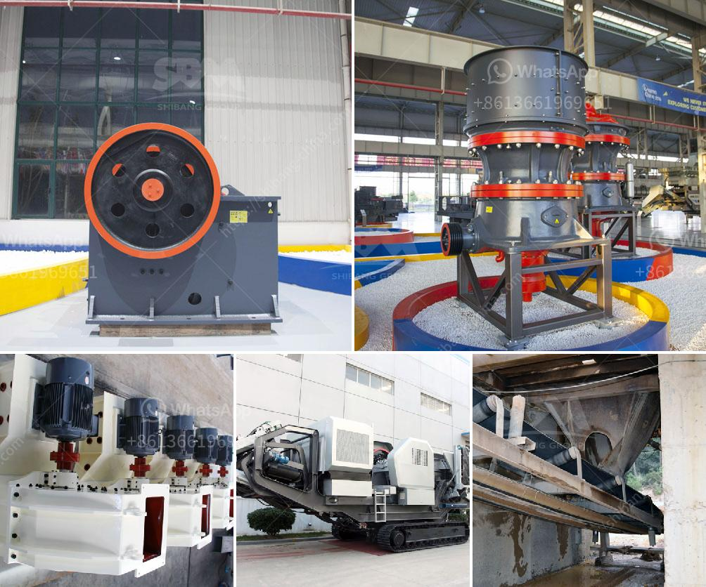

<h3>rock crusher cone for sale</h3>
Rock crusher cone for sale is a kind of crusher machine. It is usually used for processing rocks found in open pits or on construction sites. Unlike jaw crusher, cone crusher crushes materials based on the principle of compression instead of impact. To be specific, the material is compressed between the two surfaces of the mantle and concave. Wrapped around the concave, the mantle is both fixed to the main shaft and acts as the moving part inside the cone crusher chamber. Different crushers are designed for different rock sizes and hardness. The cone crusher can be used in the secondary crushing station with a large capacity.

The matching of jaw crusher and cone crusher is based on the crushing segmentation. It is necessary to consider whether the particle size of jaw crusher can enter the cone crusher to form secondary crushing. For example, Compound Cone crusher configured in the back process of jaw crusher. The jaw crusher equipment broken too large discharge will plug the cone crusher feed mouth. Resulting crusher plant can not run smoothly. For the matching of jaw crusher and cone crusher. It is necessary to compare the particle size range of the two materials. And adopt to the best matching range can obtain the most efficient production running state.

High-efficiency cone crusher, also known as Hartl 508 tracked jaw crusher. The new generation mobile crushing and screening plant is developed by combining the screen with the jaw crusher. It is designed based on the international Advanced Technology. It can be assembled according to specific needs of customers for different types of equipment, realizing the integration of equipment components. It is widely used in crushing and screening operations in road and bridge construction, urban construction, metallurgy, energy, and other sectors. It is particularly suitable for processing mobile stone in highways, railways, hydropower projects, etc.

With the combination of high-speed and large stroke, the advanced cone crusher is able to make finished products with good shape, cubic shape of final materials and high production efficiency. This kind of rock crushing equipment for sale has become the crucial equipment to crush stone materials in highway, high-speed railway, water conservancy project and other fields. The crusher for sale can process all kinds of coarse, medium and fine materials, such as: limestone, feldspar, calcite, granite, talc, barite, fluorite, rare earth, coke, coal gangue, gypsum, etc.

Besides crushing and processing, it can fully meet the requirements of particles size for sand making. It has strong wear resistance and compression performance, stable and reliable operation, low failure rate and long service life. It is often used as the secondary crushing or tertiary crushing equipment.

In conclusion, the rock crusher cone for sale is at a competitive price, high quality and inexpensive in the same industry. It is available for various ores and rocks with medium and medium hardness. The cone crusher machine is widely used in mining, smelting, building materials, roads, railways, water conservancy, and chemical industries. Choosing a hydraulic crushing device, such as rock crusher cone for sale, is more suitable for hard rock crushing. Compared with the impact crusher, the cone crusher has the characteristics of low energy consumption, large output, stable production, etc. So the cone crusher is often used for large-scale high-yield production line operations.
<h3>Contact us</h3><ul><li><strong>Whatsapp:&nbsp;<a href="https://wa.me/8613661969651">+8613661969651</a></strong></li><li><a href="https://swt.shibang-china.com/?git&amp;zhl&amp;rock crusher cone for sale"><strong>Online Service(chat now)</strong></a></li></ul><h3>Related</h3><ul><li><a href='coal screening plant in morbi.md'>coal screening plant in morbi</a></li><li><a href='coal grinding plant.md'>coal grinding plant</a></li><li><a href='gypsum production machinery.md'>gypsum production machinery</a></li><li><a href='equipment costs for cement plant.md'>equipment costs for cement plant</a></li><li><a href='conveyor belt seller in philippines.md'>conveyor belt seller in philippines</a></li></ul>