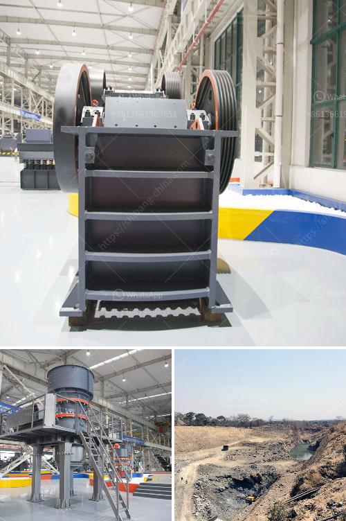

<h3>rock crusher distributors in phillipinwes</h3>
Rock crusher is essential equipment in mining machinery, mainly includes jaw crusher, cone crusher, impact crusher, hammer crusher, mobile crusher, etc. There are countless rock crusher distributors in the Philippines, catering to various specifications and different uses. It is difficult to select the best distributor from the numerous sources. This article will provide some tips for choosing the right rock crusher distributor in the Philippines.

One of the first things to consider when searching for a rock crusher distributor is the reputation of the company. A reputable distributor will have good reviews and feedback from previous customers. You can also check if they have any certifications or if they are authorized dealers for specific brands. A distributor with a good reputation indicates that they have a solid track record of providing quality products and excellent customer service.

In addition to reputation, it is important to consider the range of rock crushers offered by the distributor. Different rock crushers have different features and capabilities. It is essential to choose a distributor that offers a wide selection of rock crushers to cater to different needs and requirements. This will ensure that you can find the best crusher for your specific application.

Another important factor to consider is after-sales service. A reliable rock crusher distributor should provide excellent after-sales service, including maintenance, repair, and spare parts availability. It is crucial to have access to prompt and efficient after-sales service to minimize downtime and ensure optimum performance of the equipment. Check if the distributor has a dedicated team or service center to handle these services and if they have a readily available stock of spare parts.

Price is also a factor to consider. While it is essential to find a rock crusher distributor that offers competitive prices, it is equally important to ensure that the products are of high quality. Cheaper options may seem attractive initially, but they may not last long or deliver the desired performance. It is advisable to strike a balance between price and quality to ensure the best value for your money.

Furthermore, it is recommended to choose a rock crusher distributor that offers technical support. This is particularly important if you are not familiar with the operation and maintenance of rock crushers. A distributor that provides technical support will be able to guide and assist you in using the equipment effectively, troubleshooting any issues that may arise.

In conclusion, when searching for rock crusher distributors in the Philippines, it is important to consider their reputation, range of products, after-sales service, price, and technical support. Taking these factors into account will help you find a reliable distributor that can provide you with the best rock crusher for your specific needs. Ultimately, investing in a quality rock crusher will contribute to the success and productivity of your mining or construction operations.
<h3>Contact us</h3><ul><li><strong>Whatsapp:&nbsp;<a href="https://wa.me/8613661969651">+8613661969651</a></strong></li><li><a href="https://swt.shibang-china.com/?git&amp;zhl&amp;rock crusher distributors in phillipinwes"><strong>Online Service(chat now)</strong></a></li></ul><h3>Related</h3><ul><li><a href='rock crushing plant.md'>rock crushing plant</a></li><li><a href='sand washing screener florida.md'>sand washing screener florida</a></li><li><a href='grinding plant in rajasthan.md'>grinding plant in rajasthan</a></li><li><a href='equipment cost for silica sand mining.md'>equipment cost for silica sand mining</a></li><li><a href='10 inches marble grinding stone.md'>10 inches marble grinding stone</a></li></ul>