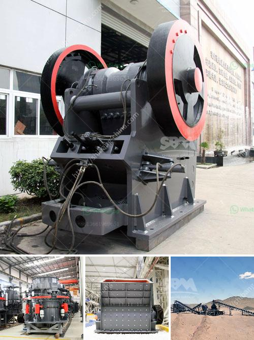

<h3>rock crusher in europe</h3>
The rock crusher is the quintessential equipment in the construction industry. It is a machine that takes big rocks and crushes them into smaller stones or gravel. This transformative process is vital for many applications in the construction industry.

In Europe, the rock crusher is widely used due to its reliable performance and low operational cost. Its versatility and efficiency make it an essential piece of equipment for the construction industry. From building roads to constructing foundations, the rock crusher plays a crucial role in the completion of various projects.

One of the primary applications of the rock crusher is in road construction. Europe boasts an extensive road network that interconnects its member states, allowing for smooth transportation of goods and people. To maintain and expand this network, new roads need to be built and existing ones repaired. The rock crusher's ability to crush the rocks into smaller pieces of the desired size makes it an invaluable tool in this process.

Furthermore, the construction of buildings and infrastructure projects requires a solid foundation. The rock crusher is instrumental in providing the necessary materials for these foundations. Whether it is a high-rise building or a simple residential structure, the rock crusher plays a vital role in creating a sturdy and reliable base.

In addition to construction applications, the rock crusher is also utilized in various mining operations. Mines across Europe extract valuable minerals and metals, and the process often involves crushing large rocks to extract the desired elements. The rock crusher's ability to break down rocks efficiently allows for the extraction process to run smoothly, increasing productivity and profitability.

Moreover, the rock crusher's versatility makes it an essential tool for other industries as well. For instance, the agricultural sector benefits from the crushed rocks by using them as fertilizers or soil conditioners. The crushed rocks act as a source of essential nutrients for crops, contributing to higher yields and improved farming practices.

When it comes to choosing the right rock crusher for European construction applications, there are several factors to consider. Firstly, the size and hardness of the rocks being processed should be taken into account. Different crushers are designed for varying rock types, ensuring optimal performance and durability. Additionally, it is crucial to consider the desired output size as this impacts the choice of crusher. Efficiency, maintenance requirements, and cost-effectiveness should also be evaluated.

In conclusion, the rock crusher is an indispensable piece of equipment for the construction industry in Europe. Its ability to crush rocks into smaller pieces or gravel significantly contributes to the completion of various projects, such as road construction, building foundations, and mining operations. The rock crusher's versatility and efficiency make it an essential tool across different industries. When selecting the appropriate rock crusher, factors such as rock type, desired output size, and maintenance requirements should be considered. As Europe continues to develop and expand its infrastructure, the rock crusher will maintain its status as a critical piece of equipment.
<h3>Contact us</h3><ul><li><strong>Whatsapp:&nbsp;<a href="https://wa.me/8613661969651">+8613661969651</a></strong></li><li><a href="https://swt.shibang-china.com/?git&amp;zhl&amp;rock crusher in europe"><strong>Online Service(chat now)</strong></a></li></ul><h3>Related</h3><ul><li><a href='small jaw crusher for sale.md'>small jaw crusher for sale</a></li><li><a href='mills for limestone in bolivia.md'>mills for limestone in bolivia</a></li><li><a href='distributors of conveyor belts in mexico.md'>distributors of conveyor belts in mexico</a></li><li><a href='hammer crusher pc400.md'>hammer crusher pc400</a></li><li><a href='crushing plant working.md'>crushing plant working</a></li></ul>