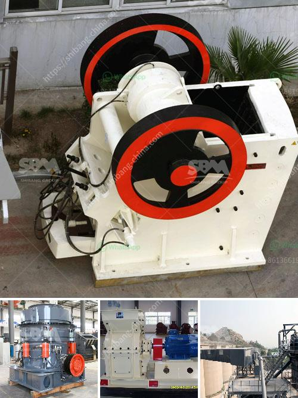

<h3>rock crusher machines</h3>
Rock crusher machines have become more and more popular in recent years due to their ability to crush and process hard rocks and ores efficiently. In many cases, crushing is the first step in the material handling process and requires a reliable and robust machine capable of handling a wide range of material types.

One of the key advantages of rock crusher machines is their low operating costs. These machines are designed to handle large quantities of material, minimizing the need for frequent equipment maintenance and reducing downtime. Additionally, the energy consumption of rock crusher machines is relatively low, resulting in lower electricity bills and reduced environmental impact.

There are various types of rock crusher machines available in the market, each with different capabilities and features to suit different applications. Jaw crushers are commonly used in the mining and construction industries for primary crushing of materials. They are ideal for processing hard and abrasive rocks, as well as recycled materials, and offer a high reduction ratio.

Another popular type of rock crusher machine is the cone crusher. It is used to crush medium-hard to hard and abrasive rocks, stones, ores, and minerals. Unlike jaw crushers, the cone crusher utilizes a smaller cone-shaped crushing chamber, providing a finer end product size. This allows for more precise size reduction and generates a higher percentage of desirable fines.

Impact crushers are also commonly used in the mining and construction industries. They are designed to crush rocks and ores by applying a high amount of force. Impact crushers can be used for primary, secondary, or tertiary crushing and offer excellent versatility. They are ideal for processing materials with a high silica content and are capable of producing aggregates with a consistent shape and size distribution.

When selecting a rock crusher machine, it is essential to consider factors such as the feed size, required product size, capacity, and desired end product specifications. In addition, the machine's durability, reliability, and ease of maintenance are important considerations to ensure a cost-effective operation over the long term.

To further increase the efficiency of rock crusher machines, various technological advancements have been made. For instance, the integration of automation systems allows for remote control and monitoring of the machine's performance, reducing the need for human intervention. This enhances safety, optimizes production, and minimizes maintenance costs.

In conclusion, rock crusher machines have proven to be a cost-effective solution for crushing hard rocks and ores. Their low operating costs, energy efficiency, and versatile features make them ideal for various applications in the mining and construction industries. Choosing the right type of rock crusher machine is crucial to ensure optimized performance, reduced downtime, and a high return on investment. With continual advancements in technology, these machines are expected to become even more efficient and reliable in the near future.
<h3>Contact us</h3><ul><li><strong>Whatsapp:&nbsp;<a href="https://wa.me/8613661969651">+8613661969651</a></strong></li><li><a href="https://swt.shibang-china.com/?git&amp;zhl&amp;rock crusher machines"><strong>Online Service(chat now)</strong></a></li></ul><h3>Related</h3><ul><li><a href='sandstone crusher quarry.md'>sandstone crusher quarry</a></li><li><a href='rubble recycle concrete crusher hire.md'>rubble recycle concrete crusher hire</a></li><li><a href='vertical roller grinding mill for sale.md'>vertical roller grinding mill for sale</a></li><li><a href='barite jaw crusher manufacturing companies.md'>barite jaw crusher manufacturing companies</a></li><li><a href='used gold washer machine plant.md'>used gold washer machine plant</a></li></ul>