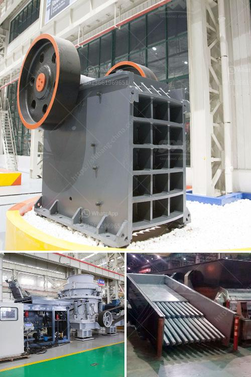

<h3>rock crusher quarry</h3>
Limestone mining is one of the most prevalent industries in numerous countries across the globe. As a raw material, limestone is essential in the manufacturing of various everyday products such as cement. Indeed, one of the key pioneers in the industry was Henry J. Kaiser himself, whose company, Kaiser Steel, operated several limestone quarries in California during the mid-1900s.

One such quarry that continues to thrive today is the Rock Crusher Quarry in Okeechobee County, Florida. This quarry is part of the five-quarry limestone mining complex owned by Okeechobee Materials, and it operates year-round, providing high-quality limestone aggregates to serve the construction, road building, and cement production industries.

The Rock Crusher Quarry boasts a 200-acre site that includes a landscape of lush greenery, nestled along the outskirts of the town of Okeechobee. In addition to its natural beauty, the location offers convenient access to major highways and railway lines, ensuring the consistent and efficient delivery of limestone products to customers.

One of the primary reasons for the success of the Rock Crusher Quarry is its vast limestone reserves. The quarry is estimated to contain over 100 million tons of limestone, making it one of the largest mineral deposits in the region. With such a significant reserve, the quarry provides a stable and reliable source of limestone for decades to come.

To extract limestone from the quarry, modern equipment and machinery are utilized. Heavy-duty rock crushers and screens are employed to break down limestone into smaller pieces suitable for various applications. These crushers can handle large rocks, ensuring that the limestone extracted meets the required specifications.

Moreover, the Rock Crusher Quarry prioritizes environmental sustainability alongside operational efficiency. The company implements strict measures to minimize its impact on the local ecosystem. For instance, it utilizes state-of-the-art dust control systems to control the spread of dust particles during the crushing and screening processes. Additionally, the quarry has implemented rigorous land restoration plans to restore the land to its natural state once the quarrying operations are complete.

The Rock Crusher Quarry also fosters a strong commitment to safety. Employees undergo regular training to ensure they adhere to strict safety protocols, ultimately reducing accident risks and promoting a harmonious work environment. This commitment to safety extends to all parties involved, including contractors and visitors, making it a safe destination for all.

The Rock Crusher Quarry is not just a source of essential raw materials; it is also a significant contributor to the local economy and community. As a major employer in the region, the quarry provides stable jobs for residents, boosting the local economy. Additionally, the company actively engages with the community through various corporate social responsibility initiatives, supporting education, health, and environmental causes.

In conclusion, the Rock Crusher Quarry in Okeechobee County, Florida, is a beacon in the limestone mining industry. It provides high-quality limestone aggregates while prioritizing environmental sustainability and safety. With its vast limestone reserves and commitment to community development, the quarry solidifies its position as a valuable asset to both the industry and the local community.
<h3>Contact us</h3><ul><li><strong>Whatsapp:&nbsp;<a href="https://wa.me/8613661969651">+8613661969651</a></strong></li><li><a href="https://swt.shibang-china.com/?git&amp;zhl&amp;rock crusher quarry"><strong>Online Service(chat now)</strong></a></li></ul><h3>Related</h3><ul><li><a href='difference between raymond mill and ball mill.md'>difference between raymond mill and ball mill</a></li><li><a href='granite crushers machine from germany.md'>granite crushers machine from germany</a></li><li><a href='production process of limestone.md'>production process of limestone</a></li><li><a href='ball mill machine price.md'>ball mill machine price</a></li><li><a href='primary jaw crusher saudi.md'>primary jaw crusher saudi</a></li></ul>