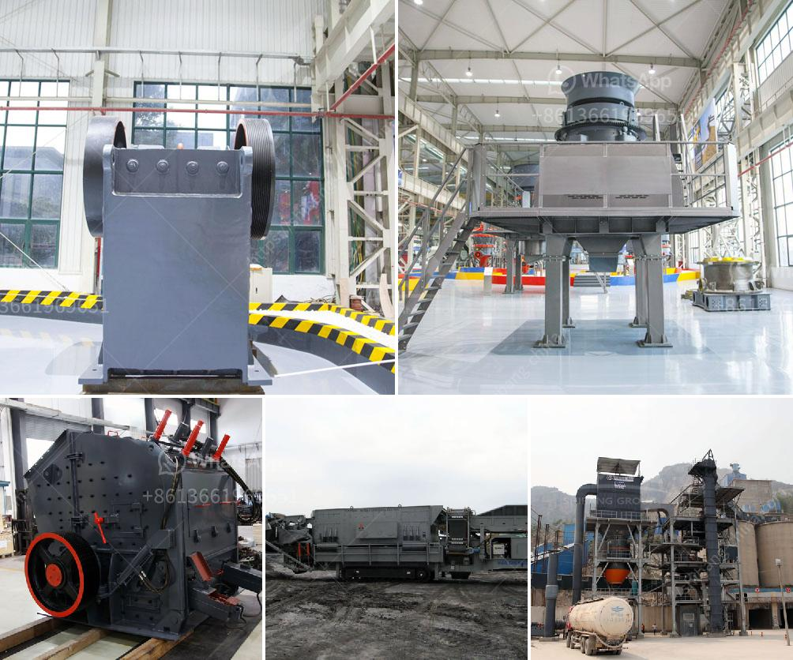

<h3>rock crusher road construction</h3>
Rock Crusher Road is a heavily traveled roadway that connects the rural communities of Citrus County, Florida. This arterial road plays a crucial role in the transportation of goods, materials, and people in the area. Over time, the wear and tear of heavy traffic have taken their toll on this stretch of road, leading to deteriorating conditions and safety concerns. To address these issues, a road construction project has been proposed to improve Rock Crusher Road.

The primary objective of this construction project is to enhance the durability and safety of Rock Crusher Road. The road will undergo significant repairs and renovations, including resurfacing, widening, and the installation of safety features such as improved signage, guardrails, and shoulders. These upgrades will ensure a smoother and safer driving experience for all motorists who utilize this road.

Moreover, the construction project will also address drainage issues that have been a persistent problem on Rock Crusher Road. The addition of proper drainage systems will prevent water accumulation and minimize the risk of flooding, especially during heavy rainfall.

In addition to the immediate improvements, the construction of Rock Crusher Road will also provide long-term benefits to the community. The enhanced infrastructure will promote better connectivity between communities and facilitate economic growth. The improved road conditions will make transportation more efficient and reliable, benefiting businesses, industries, and the general public alike.

However, it's important to note that such construction projects come with temporary inconveniences. During the construction period, traffic diversions and detours may be implemented to ensure the safety of both construction workers and road users. Motorists are advised to follow the prescribed alternative routes and be patient, considering the long-term benefits outweigh the short-term inconveniences.

Overall, the construction of Rock Crusher Road is a vital step towards improving the infrastructure and safety of the region. By investing in this important roadway, the community is ensuring the sustained growth and development of the area for years to come. As with any construction project, the cooperation and understanding of the community are essential to successfully transform Rock Crusher Road into a safer and more efficient route for everyone.
<h3>Contact us</h3><ul><li><strong>Whatsapp:&nbsp;<a href="https://wa.me/8613661969651">+8613661969651</a></strong></li><li><a href="https://swt.shibang-china.com/?git&amp;zhl&amp;rock crusher road construction"><strong>Online Service(chat now)</strong></a></li></ul><h3>Related</h3><ul><li><a href='price and 900 stone crusher.md'>price and 900 stone crusher</a></li><li><a href='gold mining equipment in uae.md'>gold mining equipment in uae</a></li><li><a href='consumption of ball mill with roller.md'>consumption of ball mill with roller</a></li><li><a href='pf series impact crushers in alibaba.md'>pf series impact crushers in alibaba</a></li><li><a href='hydrated lime production processing.md'>hydrated lime production processing</a></li></ul>