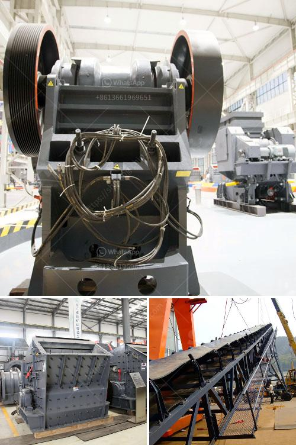

<h3>rock crushers ball mill</h3>
Rock crushers are a staple in mining and construction industries. They are often used to break large rocks into smaller pieces, making them easier to handle and transport. With their ability to crush hard materials, rock crushers have earned their place in the construction industry.

One type of rock crusher that has gained popularity in recent years is a ball mill crusher. A ball mill is a type of grinder used to grind, blend, and sometimes for mixing of materials for use in mineral dressing processes, paints, pyrotechnics, ceramics, and selective laser sintering. It works by reducing the size of particles fed into the mill and ensuring that they are finely ground.

Ball mill crushers excel at breaking down hard materials, such as rocks, into smaller, more manageable sizes. They are able to achieve this through the use of a rotating cylinder filled with steel balls and a series of crushing and grinding actions. The crushed material is then discharged from the ball mill through a screen, ensuring that only the desired particle size is achieved.

One of the advantages of using a ball mill crusher is its versatility. It can be used for both dry and wet grinding, making it suitable for a wide range of materials. It is capable of processing materials with a hardness of up to 9.3 on the Mohs scale, making it ideal for crushing rocks.

In addition to crushing rocks, ball mill crushers can also be used to grind other materials, such as ores, chemicals, and even glass. This makes them an essential tool in many industries, including mining, cement, and ceramics.

The design of ball mill crushers is such that they are durable and efficient. They are built to withstand heavy usage and can process large quantities of materials. This is important in the mining industry, where a large amount of rock needs to be crushed and ground to extract valuable minerals.

Rock crushers ball mill crushers are also relatively low maintenance. They require minimal lubrication and can be easily repaired or replaced if necessary. This makes them a cost-effective option for businesses looking to crush and grind materials.

Overall, rock crushers ball mill crushers are a valuable addition to any mining or construction operation. They are able to efficiently break down hard materials and produce the desired particle size. Their versatility and durability make them an essential tool in many industries.

In conclusion, rock crushers ball mill crushers play a vital role in mining and construction industries. They are capable of crushing and grinding hard materials, making them suitable for a wide range of applications. With their durability and efficiency, they are a cost-effective option for businesses looking to process large quantities of rock and other materials.
<h3>Contact us</h3><ul><li><strong>Whatsapp:&nbsp;<a href="https://wa.me/8613661969651">+8613661969651</a></strong></li><li><a href="https://swt.shibang-china.com/?git&amp;zhl&amp;rock crushers ball mill"><strong>Online Service(chat now)</strong></a></li></ul><h3>Related</h3><ul><li><a href='vertical hammer crusher.md'>vertical hammer crusher</a></li><li><a href='impact crusher in lima peru.md'>impact crusher in lima peru</a></li><li><a href='feldspar beneficiation plant.md'>feldspar beneficiation plant</a></li><li><a href='working principle of pebble mill.md'>working principle of pebble mill</a></li><li><a href='used stone crusher for sale in dubai.md'>used stone crusher for sale in dubai</a></li></ul>