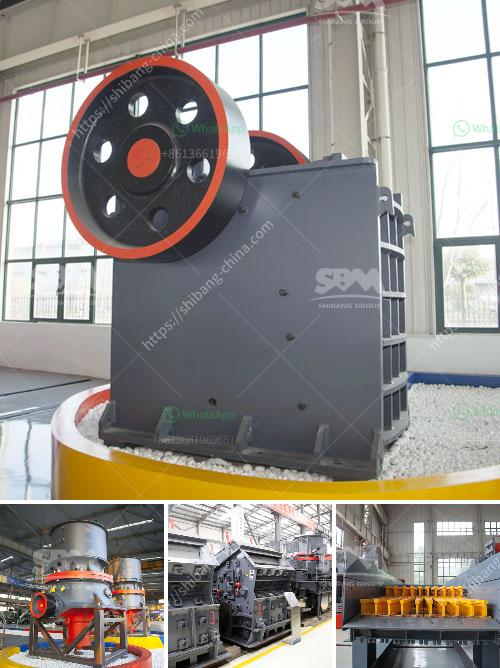

<h3>rock crushing equipment for sale</h3>
The construction and mining industries rely heavily on rock crushing equipment to break down a variety of materials into smaller, more manageable sizes. Whether it is gravel for roads, concrete for buildings, or minerals for mining, rock crushers are an essential piece of machinery for these industries. Fortunately, there is a wide range of rock crushing equipment for sale that provides efficient and cost-effective solutions for crushing rocks, making it easier for companies to meet their production targets.

One of the primary benefits of rock crushing equipment is its versatility. These machines can crush a variety of rocks, including limestone, basalt, granite, and more. This versatility allows companies to produce different sizes of aggregates, which are in high demand in the construction industry. Additionally, these machines can also handle a wide range of other materials, such as concrete, asphalt, and mineral ores, making them suitable for use in different applications.

When it comes to selecting rock crushing equipment for sale, there are several factors to consider. Firstly, the capacity is crucial. Machines with higher capacity can handle larger volumes of materials, enabling faster production rates. Secondly, the size of the input material and the desired output size should be taken into account. Different crushers have different capabilities, and companies need to find the right match for their specific requirements. Lastly, ease of maintenance is also an essential consideration. Crushers that are simple to maintain can reduce downtime, maximizing productivity and minimizing operational costs.

There are several types of rock crushing equipment available in the market. Jaw crushers, for example, are commonly used in the primary crushing stage and have a large feed opening. They can handle a wide range of materials and produce excellent reduction ratios. Cone crushers, on the other hand, are ideal for secondary and tertiary crushing. They are capable of producing finely crushed materials and have a higher reduction ratio compared to jaw crushers.

Impact crushers are another popular choice in the rock crushing industry. They use impact force to break down larger rocks into smaller pieces, making them suitable for various applications, including the production of high-quality aggregates. Additionally, there are specialized crushers, such as gyratory crushers, which are specifically designed for crushing large rocks at high capacities.

With the advancement of technology, rock crushing equipment has become more efficient and user-friendly. Many machines now incorporate hydraulic systems for easy adjustment of the crusher settings, reducing the time required for maintenance and enhancing operational efficiency. Additionally, modern crushers often feature automation systems that optimize performance and reduce the risk of human error.

In conclusion, rock crushing equipment for sale plays a vital role in the construction and mining industries. Its versatility, capacity, and ease of maintenance make it an indispensable tool for companies in need of efficient rock crushing solutions. By carefully considering the different types of crushers and their capabilities, businesses can select the most suitable equipment for their specific needs. With the continuous advancement of technology, rock crushing equipment is likely to become even more efficient and innovative in the years to come, further improving productivity and profitability for these industries.
<h3>Contact us</h3><ul><li><strong>Whatsapp:&nbsp;<a href="https://wa.me/8613661969651">+8613661969651</a></strong></li><li><a href="https://swt.shibang-china.com/?git&amp;zhl&amp;rock crushing equipment for sale"><strong>Online Service(chat now)</strong></a></li></ul><h3>Related</h3><ul><li><a href='charcoal pulverizer machine philippines.md'>charcoal pulverizer machine philippines</a></li><li><a href='cost of the project for 100 tph stone crushing unit.md'>cost of the project for 100 tph stone crushing unit</a></li><li><a href='chilli crushing machine project report.md'>chilli crushing machine project report</a></li><li><a href='double roller crusher advantages.md'>double roller crusher advantages</a></li><li><a href='silica sand price per tonne.md'>silica sand price per tonne</a></li></ul>